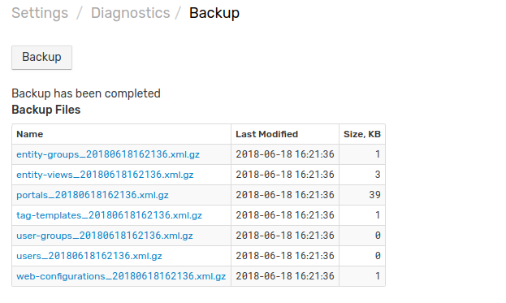
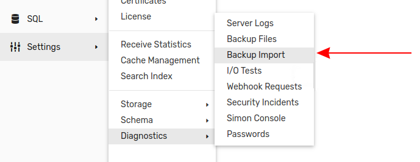
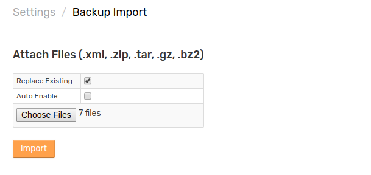
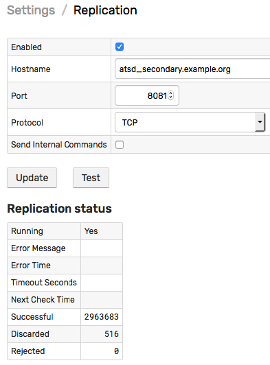
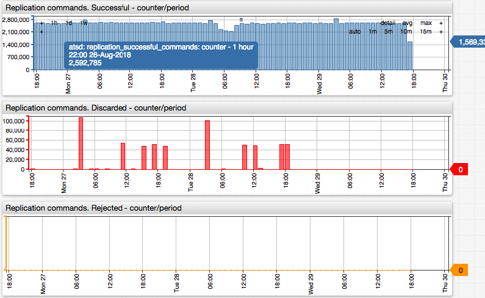

# Backup and Restore

This document describes how to backup and replicate [configuration records](#configuration-records) and [data](#data) in ATSD.

## Configuration Records

The database performs a regular backup of the `/opt/atsd/atsd/conf` directory and the following configuration types:

* [CSV Parsers](../parsers/csv/README.md)
* [Entities](../README.md#glossary)
* [Entity Groups](../configuration/entity_groups.md)
* [Entity Views](../configuration/entity_views.md)
* [Export Jobs](../reporting/scheduled-exporting.md#export-job-logging)
* [Export Queries](../sql/scheduled-sql.md)
* [Forecast Settings](../forecasting/README.md)
* [Metrics](../README.md#glossary)
* [Named Collections](../rule-engine/functions-random.md#named-collection)
* [Portals](../portals/README.md)
* [Replacement Tables](../sql/examples/lookup.md#replacement-tables)
* [Rules](../rule-engine/README.md#developing-rules)
* [Tag Templates](../configuration/tag-templates.md)
* [Users](./collector-account.md#create-user)
* [User Groups](./collector-account.md#create-user-group)
* [Outgoing Webhooks](../rule-engine/notifications/webhook.md)

Configuration backup **does not** include [data tables](./data_retention.md#data-tables) containing series, property, or message records. Refer to [Data](#data) section for data backup options.

The database performs a [scheduled backup](#scheduled-backup) each day at a specified time.

To reduce the amount of used disk space, backups of `metric` and `entity` types only contain records with non-default settings such as custom tags, labels, or field values.

### Manual Backup

Open the **Settings > Diagnostics > Backup Files** page.


Click **Backup** to create a new backup manually. New backup files appear in the **Backup Files** table alongside **Last Modified** and **Size, KB** information.



Download individual backup archives by clicking the link in the **Name** column or copy the files from the [backup directory](#backup-directory). The name of the archive contains the backup creation date.

### Scheduled Backup

The database creates daily backup files in the [backup directory](#backup-directory) at `23:30` [local server time](./timezone.md).

The schedule is controlled with the `internal.backup.schedule` property which can be modified on the [**Settings > Server Properties**](./server-properties.md) page.

New backup files do not replace existing backup files. Each backup is timestamped with the date and time of creation.

Backup of the `/opt/atsd/atsd/conf` directory includes nested directories and is stored in `conf_{timestamp}.tar.gz` archive.

Configure an external `cron` job to prune old backup files and to move records to a different directory.

### Backup Directory

By default, ATSD stores backup data in the `/opt/atsd/atsd/backup` directory.

To change the directory, for example to store files on a network-mounted file system, modify the `backup.data.directory` property on the [**Settings > Server Properties**](./server-properties.md) page.

### Restore

The records from the selected backup archive can be restored on the same ATSD instance or on another ATSD instance.

Choose one or more backup files to revert ATSD configuration to an earlier date. Alternatively, import records in another ATSD instance to replicate a configuration.

Open the **Settings > Diagnostics > Backup Import** page.



Upload the selected backup files by clicking **Choose Files**. If needed, select multiple files. Click **Import** to restore records from the selected backup files.



**Backup Import** has two optional settings:

* **Replace Existing** setting instructs the database to replace existing records with new records in case of match. If disabled, and matching records exist in the database, the database retains existing records unchanged and ignores matching records in the backup file.
* **Auto Enable** setting controls whether or not uploaded records are [enabled](./data_retention.md#disable-metric) by default.

## Data

### Command Replication

To copy the received **data** commands to another ATSD instance, configure the destination on the **Settings > Replication** page.



Replication status can be monitored with the built-in metrics:

* `replication_successful_commands`
* `replication_discarded_commands`
* `replication_rejected_commands`



### Cluster Replication

To replicate all changes in the underlying database to another database instance, follow the instructions in the [Replication](./replication.md) guide.

### Base Directory Copy

This method involves copying files on the local file system and only applies to [standalone](../installation/packages.md) installations.

Stop ATSD.

```sh
/opt/atsd/bin/atsd-all.sh stop
```

Copy the `/opt/atsd` directory to the backup directory.

```sh
cp -a /opt/atsd/ /path/to/backup-dir
```

Start ATSD.

```sh
/opt/atsd/bin/atsd-all.sh start
```

### HBase Backup

Perform a backup to another HDFS cluster using the underlying HBase [Backup and Restore](https://hbase.apache.org/book.html#backuprestore) functionality.
