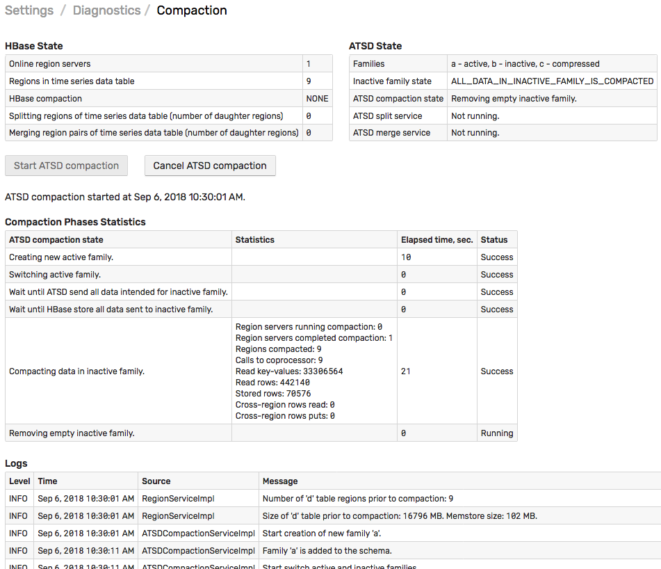

# Compaction

Compaction is a scheduled procedure to store data for each time series in the most efficient schema.

By default, ATSD compaction runs every night.

To trigger the compaction manually, open the **Settings > Storage > Compaction** page and click **Start ATSD Compaction**.

The space savings in ATSD are achieved by its built-in compression codes as well as by the file system compression in the underlying storage system (HBase).

## ATSD Compression

ATSD compression codecs are built-in and are applied automatically when the data is copied from the raw column family to the compressed column family in a process called Compaction.

The compaction is executed daily on schedule and its status is displayed on the **Settings > Storage > Compaction** page.



## File System Compression

HBase compression is enabled with `hbase.compression.type` setting in `/opt/atsd/atsd/conf/server.properties` file.

```txt
hbase.compression.type = gz
```

The following compression codecs are supported.

* `none`
* `gz`
* `lzo`

<!-- markdownlint-enable MD032 -->
:::tip lzo
The `lzo` codec requires installation of additional packages on the HBase region servers.
:::
<!-- markdownlint-disable MD032 -->

Changing the existing codec is supported however the change is applied only to new files and files re-written by HBase during a major compaction.

A change in codec requires a [database restart](./restarting.md).

The compression can be also enabled for the raw column family using the `hbase.compression.type.raw` setting.

To verify that the codec is set correctly, review the settings on the [**Settings > Server Properties**](./server-properties.md) page.