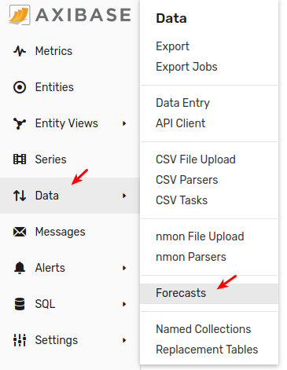
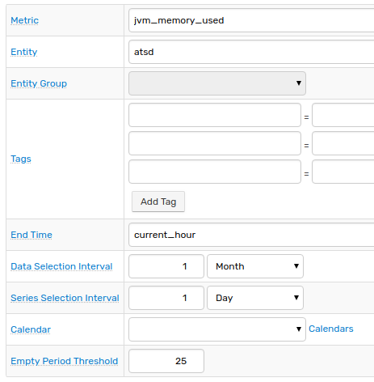
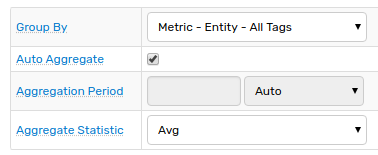
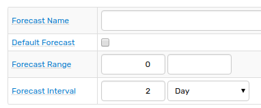
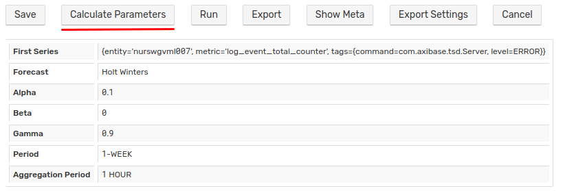
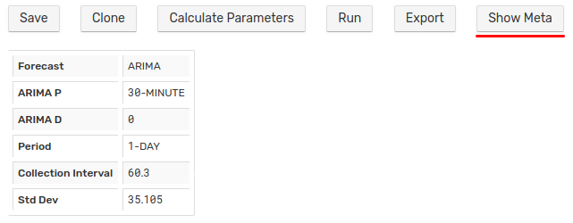
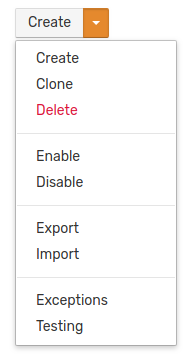
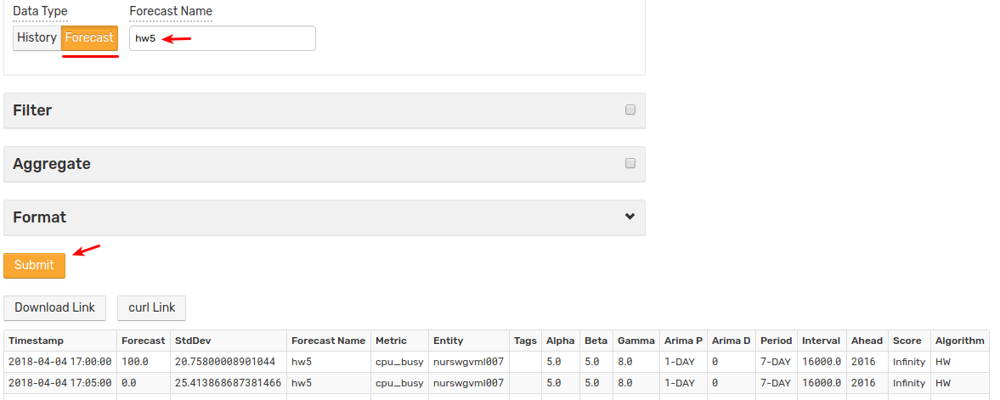

# Data Forecasting

## Overview

Axibase Time Series Database includes built-in forecasting algorithms that predict future values based on historical data. The accuracy of these predictions depends on the frequency of data collection, the selection interval, and the algorithms used. Supported algorithms for auto-regressive time series extrapolation include **Holt-Winters**, **ARIMA**.

**Forecasting Example with Abnormal Deviation**:


Forecast settings can be configured on the **Data > Forecasts** page.




## Reference

- [Editor Settings](#editor-settings)
- [Editor Tools](#editor-tools)
- [Using Forecasts](#using-forecasts)

## Editor Settings

### General Settings


Forecasts may be run on schedule according to `cron` expressions. See [**Scheduling**](../shared/scheduling.md) for configuration instructions and examples.

|Setting|Description|
|-|-|
|Retention Interval|Specifies how long a forecast should be stored in the database. Forecasts that are older than `current time` (or [`End Time`](#selection-settings), if specified) minus `Retention Interval` are deleted.|

### Data Selection Settings



| Setting | Description |
| --- | --- |
|Metric |Metric name for which forecasts will be calculated.|
|Entity  |If selected, forecasts will be limited to the specified entity. Supersedes Entity Group selector. If neither entity nor entity group is specified, forecasts will be prepared for all entities.|
|Entity Group  |If selected, forecasts will be limited to entities contained in the specified entity group.|
|Tags  |Limit the selected historical data to specified series tags.|
|End Time  |End time of the Data Selection Interval and Series Selection Interval. This field supports [calendar](../shared/calendar.md) expressions, for example 'current_day'. If `End Time` is not defined, it is set to the time the job is run.|
|Data Selection Interval  |Time frame for selecting detailed data that will be used as forecast input. End of the Selection Interval can be optionally specified in the End Time field, otherwise it is set to current time.|
|Series Selection Interval  |Ignore any series with Last Insert Time before End Time by more than the specified interval. The option can be used to ignore series which have not been updated for a long time.|
|Calendar  |Ignore detailed values within the time intervals listed in the calendar.|
|Empty Period Threshold  |Ignore series if percentage of empty periods exceeds the specified threshold. Calculated as 100 * (number of empty periods before interpolation)/(total number of aggregation periods in Data Selection Interval).|

For data exclusion options, see [Calender Exception Settings](calendar_exceptions_testing.md).

### Aggregation Settings



| Setting | Description |
| --- | --- |
|Group By |Grouping key for merging multiple series into one. Detailed data for multiple series sharing the same grouping key are merged into one array prior to computing aggregate statistics.|
|Auto Aggregate|Let server automatically identify an aggregation period that produces the most accurate forecast, defined as having the lowest variance from observed historical data.|
|Aggregation Period |Period of time over which the detailed samples are aggregated.|
|Aggregate Statistic |Aggregation function applied to raw data in order to regularize the series. Aggregate values for empty periods without detailed data are interpolated as values of aggregate functions for previous periods.|

### Algorithm Parameters


| Setting | Description |
| --- | --- |
|Algorithm |Holt-Winters or ARIMA forecasting algorithms.|
|Score Interval |Part of Data Selection Interval that will be used to compute variance between observed values and forecast to rank forecasts by variance. The shorter the Score Interval, the more weight assigned to recently observed values.|
|Auto Period |Let server automatically identify seasonality of the underlying series that produces the most accurate forecast, defined as having the lowest variance from observed historical data.|
|Period |Specify seasonality of the underlying series.|
|Auto Parameters |Let server automatically identify algorithm parameters that produce the most accurate forecast, defined as having the lowest variance from observed historical data.|

### Persistence Settings



| Setting | Description |
| --- | --- |
|Forecast Name |An optional name that can be used to differentiate forecasts for the same underlying series prepared with different forecast settings.<br>Use cases:<br> &bull; [`forecastName`](../api/data/series/query.md#forecast-filter) field in Data API<br>&bull; [`forecast(name)`](../rule-engine/functions-forecast.md#forecaststring-n) Rule Engine function<br>&bull; [`forecast-name`](#chart-settings) Chart setting |
|Default Forecast |Use these settings instead of default settings when calculating on-demand forecast. On-demand forecast is calculated at request time if a pre-stored forecast is not available.|
|Forecast Range |Minimum and Maximum constraints applied to the stored forecast values to ensure that such values are within the specified range. Constraints are applied to the winning forecast after scoring stage.|
|Forecast Interval |The length of time into the future for which forecasts are to be prepared and stored in the database. Can be rounded upwards to the nearest forecast period.|

## Editor Tools

Forecast Settings Editor provides the following tools:


- **Calculate Parameters**

  This option calculates algorithm parameters:

  

- **Run**

  This option runs the forecast job and may be used for tests:

  

- **Export**

  Export forecast data in csv:

  

  

- **Show Meta**

   This option displays values of the main settings by which this forecast is calculated:

   

   Metadata is stored with the forecast. Collection interval is an interval within the real data were extracted to build the forecast.

Split button on the **Data > Forecasts** page may be used to specify [Exceptions](calendar_exceptions_testing.md#exceptions) and perform [Testing](calendar_exceptions_testing.md#testing):



## Using Forecasts

### Rule Engine

Forecast values may be used as [thresholds](../rule-engine/README.md#forecast-thresholds) for rules to trigger an alert if actual values deviate from forecast values by some amount. Forecast values may be compared to actual values using [statistical functions](../rule-engine/README.md#functions-forecast.md) such as standard deviation as well as raw value.

```javascript
abs(avg() - forecast()) > 25
```

This setting compares the actual [average value](../rule-engine/functions-statistical.md#avg) of some metric to the forecast metric value and alerts if the [absolute value](../rule-engine/functions-math.md#abs) of the difference exceeds 25.

### Ad hoc Export

Set Data Type setting to 'Forecast', optionally specify the forecast name:



### Data API

Data API provides a way to [query](../api/data/series/query.md#forecast-filter) and [insert](../api/data/series/insert.md#fields) forecast values. The `insert` capability can be used to populate the database with custom forecast values calculated externally.

A sample forecast [JSON query](../api/data/series/examples/query-named-forecast.md):

```json
[
    {
        "entity": "nurswgvml007",
        "metric": "cpu_busy",
        "type": "FORECAST",
        "endDate": "now + 2 * hour",
        "startDate": "now "
    }
]
```

<details><summary>Open collapsed menu to view response.</summary>

```json
[
  {
    "entity": "nurswgvml007",
    "metric": "cpu_busy",
    "tags": {},
    "type": "FORECAST",
    "aggregate": {
      "type": "DETAIL"
    },
    "meta": {
      "timestamp": "2018-05-15T08:20:00.000Z",
      "averagingInterval": 600000,
      "alpha": 0,
      "beta": 0.4,
      "gamma": 0.4,
      "period": {
        "count": 1,
        "unit": "DAY"
      },
      "stdDev": 7.224603272075089
    },
    "data": [
      {
        "d": "2018-05-15T08:20:00.000Z",
        "v": 11.604692968987015
      },
      {
        "d": "2018-05-15T08:30:00.000Z",
        "v": 14.052095586152106
      },
      {
        "d": "2018-05-15T08:40:00.000Z",
        "v": 15.715682104344845
      },
      {
        "d": "2018-05-15T08:50:00.000Z",
        "v": 11.604018743609409
      },
      {
        "d": "2018-05-15T09:00:00.000Z",
        "v": 12.507966355503251
      },
      {
        "d": "2018-05-15T09:10:00.000Z",
        "v": 12.59619153186056
      },
      {
        "d": "2018-05-15T09:20:00.000Z",
        "v": 11.092825413101579
      },
      {
        "d": "2018-05-15T09:30:00.000Z",
        "v": 11.747112803805937
      },
      {
        "d": "2018-05-15T09:40:00.000Z",
        "v": 11.137962830355074
      },
      {
        "d": "2018-05-15T09:50:00.000Z",
        "v": 11.40358025413789
      },
      {
        "d": "2018-05-15T10:00:00.000Z",
        "v": 16.728103701429056
      },
      {
        "d": "2018-05-15T10:10:00.000Z",
        "v": 12.75646043607565
      }
    ]
  }
]
```

</details>

[Insert a forecast](../api/data/series/examples/insert-forecast.md) into ATSD using POST method:

```elm
POST https://atsd_hostname:8443/api/v1/series/insert
```

This will deliver the JSON payload:

```json
[
    {
        "entity": "nurswgvml007",
        "metric": "mpstat.cpu_busy",
        "type": "FORECAST",
        "data": [
            {
                "t": 1462427358127,
                "v": 52
            }
        ]
    }
]
```

Additional examples:

- [Insert Named Forecast](../api/data/series/examples/insert-named-forecast.md)
- [Insert Forecast Deviation](../api/data/series/examples/insert-forecast-deviation.md)

### Charts

Load forecasts data by setting `data-type = forecast` in the `[series]` section.

```ls
[series]
    entity = nurswgvml007
    metric = cpu_busy
    data-type = forecast
```

|Name|Example|Description|Example|
|---|---|---|---|
|data-type|`data-type = forecast`|Data type for the current series.<br>Possible values: historical, forecast, forecast_deviation, lower_confidence, upper_confidence.|[View](https://apps.axibase.com/chartlab/f80b8e53)|
|forecast-name|`forecast-name = hw5`|Unique identifier of the forecast.<br>Useful when creating multiple forecasts for the same series.<br>If no forecast name is set, the default forecast will be loaded.|[View](https://apps.axibase.com/chartlab/92b7e471/3/)|
|style|`style = stroke-dasharray: none;`|Remove dashes from forecast line on the chart.|[View](https://apps.axibase.com/chartlab/92b7e471/4/)|
|value|`value = (1 - forecast('free') / forecast('total')) * 100`|Returns forecast for the underlying series.|[View](https://apps.axibase.com/chartlab/da03b8a5/11/)|
|load-future-data|`load-future-data = true`|Load future series values.<br>Usually used to view imported forecasts generated with 3rd party tools, like R Language.<br>Possible values: true, false.|[View](https://apps.axibase.com/chartlab/87c197be)|
|forecast-style|`forecast-style = stroke: magenta;`|CSS styles applied to forecasts in column and column-stack modes.|[View](https://apps.axibase.com/chartlab/37c39d18/3/)|
