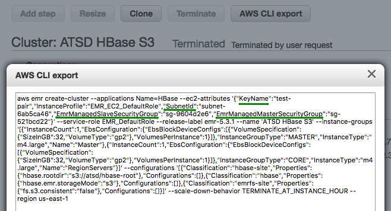
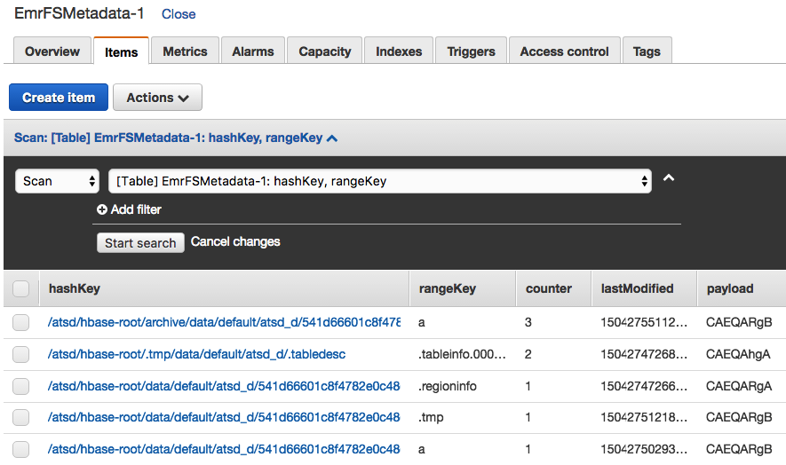

# Installation: Amazon Elastic MapReduce (EMR)

## Overview

The document describes how to deploy ATSD on HBase with [AWS S3](https://docs.aws.amazon.com/emr/latest/ReleaseGuide/emr-hbase-s3.html) as the underlying file system.

## Operational Advantages

* Scale storage and compute layers independently to handle a variety of use cases, including the **small cluster/large dataset** scenario.
* Dynamically adjust the number of region servers based on auto-scaling rules.
* Simplified backup and recovery.
* Reduced storage footprint. No need for `3-x` data replication and additional disk space required for HFile compactions.
* Increased resilience based on AWS S3 reliability and durability.
* Read-only cluster replicas.

The minimum cluster size supported by this installation option is **two** EC2 instances, one of which is shared by the HBase Master and ATSD.

## Create S3 Bucket

Create the S3 bucket prior to installation. The bucket, named `atsd` in the example below, stores the `hbase-root` directory and contains both metadata and HFiles.

```bash
aws s3 mb s3://atsd
```

If necessary, the `hbase-root` directory is created by HBase when the cluster is started for the first time. The directory is **not deleted** when the cluster is stopped.

Check the contents of the bucket prior to launching the cluster.

```bash
aws s3 ls --summarize --human-readable --recursive s3://atsd
```

## Download Distribution Files

* Amazon EMR `5.0.x` - `5.3.x` with HBase `1.2.x`

```bash
curl -o atsd-cluster.tar.gz https://axibase.com/public/atsd-cluster.tar.gz
```

* Amazon EMR `5.12.x` - `5.17.x` with HBase `1.4.x`

```bash
curl -o atsd-cluster.tar.gz https://axibase.com/public/aws/atsd-cluster-1.4.x.tar.gz
```

Refer to AWS [EMR Release Matrix](https://docs.aws.amazon.com/emr/latest/ReleaseGuide/images/emr-releases-5x.png) for more information.

## Deploy Co-processor

```bash
tar -xvf atsd-cluster.tar.gz atsd/atsd-hbase*jar
```

:::tip Co-processors
The `atsd-hbase.$REVISION.jar` file contains ATSD filters and procedures invoked by ATSD on HBase Region Servers for optimized data processing.
:::

Copy the file to HBase `lib` directory in S3 to make its classes automatically available to region servers at start time.

```bash
aws s3 cp atsd/atsd-hbase.*.jar s3://atsd/hbase-root/lib/atsd-hbase.jar
```

> The `cp` command removes the revision from the `atsd-hbase.$REVISION.jar` file to avoid changing `coprocessor.jar` setting in the `server.properties` file each time when the JAR file is replaced.

Verify that the copied file is stored as `atsd-hbase.jar` in the `hbase-root/lib` directory in S3.

```bash
aws s3 ls --summarize --human-readable --recursive s3://atsd/hbase-root/lib
```

```txt
2018-08-31 21:43:24  555.1 KiB hbase-root/lib/atsd-hbase.jar

Total Objects: 1
  Total Size: 555.1 KiB
```

Now the `atsd-hbase.jar` is stored in a directory identified by the `hbase.dynamic.jars.dir` setting in HBase which resolves to `hbase.rootdir/lib` by default.

## Launch Cluster

Copy the AWS CLI cluster launch command into an editor.

```bash
export CLUSTER_ID=$(            \
aws emr create-cluster          \
--name "ATSD HBase"             \
--applications Name=HBase       \
--release-label emr-5.3.1       \
--output text                   \
--use-default-roles             \
--ec2-attributes KeyName=<key-name>,SubnetId=<subnet>     \
--instance-groups               \
  Name=Master,InstanceCount=1,InstanceGroupType=MASTER,InstanceType=m4.large     \
  Name=Region,InstanceCount=3,InstanceGroupType=CORE,InstanceType=m4.large       \
--configurations '[{
     "Classification": "hbase",
     "Properties": { "hbase.emr.storageMode": "s3" }
  },{
     "Classification": "hbase-site",
     "Properties": { "hbase.rootdir": "s3://atsd/hbase-root" }
  }]'              \
)
```

### Choose EMR Version

Replace `emr-5.3.1` release label with the correct version:

* `emr-5.3.1` for HBase `1.2.x`
* `emr-5.17.1` for HBase `1.4.x`

### Specify Network Parameters

Replace `<key-name>` and `<subnet>` parameters.

The `<key-name>` parameter corresponds to the name of the private key used to log in to cluster nodes.

The `<subnet>` parameter is required when launching particular instance types. To discover the correct subnet for your account, launch a sample cluster manually in the AWS EMR Console and review the settings using AWS CLI export.

```bash
--ec2-attributes KeyName=ec2-pkey,SubnetId=subnet-6ab5ca46,EmrManagedMasterSecurityGroup=sg-521bcd22,EmrManagedSlaveSecurityGroup=sg-9604d2e6    \
```



### Set Cluster Size

Adjust EC2 instance types and total instance count for the `RegionServers` group as needed. Review [AWS documentation](https://docs.aws.amazon.com/emr/latest/ManagementGuide/emr-gs-launch-sample-cluster.html) for additional settings.

:::tip Tip
Cluster size can be adjusted **at runtime**, without restarting the service.
:::

The minimum number of nodes in each instance group is `1`, therefore the smallest EMR cluster can have **two** EC2 instances:

```bash
Name=Master,InstanceCount=1,InstanceGroupType=MASTER,InstanceType=m4.large        \
Name=Region,InstanceCount=1,InstanceGroupType=CORE,InstanceType=m4.large          \
```

### Enable Consistent View

For long-running production clusters, enable [EMR Consistent View](https://docs.aws.amazon.com/emr/latest/ManagementGuide/emr-plan-consistent-view.html), which identifies inconsistencies in S3 object listings and resolves them using retries with exponential timeouts. When this option is enabled, the HBase metadata is also stored in a [DynamoDB](https://docs.aws.amazon.com/emr/latest/ManagementGuide/emrfs-metadata.html) table.

Checks are enabled by adding the `Consistent` setting to the launch command.

```bash
--emrfs Consistent=true,Args=[fs.s3.consistent.metadata.tableName=EmrFSMetadata]   \
```

:::warning Avoid DynamoDB table name conflicts
Note that the EMR service does not automatically remove the specified DynamoDB table when a cluster is stopped. Delete the table manually after the cluster is deleted. When running multiple clusters concurrently, ensure that each cluster uses a different DynamoDB table name to avoid collisions (default table name is `EmrFSMetadata`.


:::

## Launch Cluster

Launch the cluster by executing the above command. The command returns a cluster ID and stores it as an environment variable.

## Verify HBase Status

### Log in to Master Node

Monitor cluster status until the bootstrapping process is complete.

```bash
watch 'aws emr describe-cluster --cluster-id $CLUSTER_ID | grep MasterPublic | cut -d "\"" -f 4'
```

Determine the public IP address of the HBase Master node.

```bash
export MASTER_IP=$(aws emr describe-cluster --cluster-id $CLUSTER_ID | grep MasterPublic | cut -d "\"" -f 4) \
&& echo $MASTER_IP
```

Specify path to private SSH key and log in to the node.

```bash
ssh -i /path/to/<key-name>.pem -o StrictHostKeyChecking=no hadoop@$MASTER_IP
```

Wait until HBase services are running on the HMaster node.

```bash
watch 'initctl list | grep hbase'
```

```txt
hbase-thrift start/running, process 8137
hbase-rest start/running, process 7842
hbase-master start/running, process 7987
```

Verify HBase version (`1.2.x` or `1.4.x`) and re-run the status command until the cluster becomes operational.

```bash
echo "status" | hbase shell
```

Wait until the cluster initializes and the `Master is initializing` message is no longer visible.

```txt
status
1 active master, 0 backup masters, 4 servers, 0 dead, 1.0000 average load
```

## Install ATSD

Log in to the server where you plan to install ATSD. For testing and development, you can co-install ATSD on the HMaster node.

```bash
ssh -i /path/to/<key-name>.pem ec2-user@$PUBLIC_IP
```

Verify that [JDK 8](../administration/migration/install-java-8.md) is installed on the server.

```bash
javac -version
```

```bash
java version
```

Change to a volume with at least **10 GB** of available disk space.

```bash
df -h
```

```bash
cd /mnt
```

Download ATSD distribution files as described [above](#download-distribution-files). Extract the files from archive.

```bash
tar -xvf atsd-cluster.tar.gz
```

Set path to Java 8 in the ATSD start script.

```bash
JP=`dirname "$(dirname "$(readlink -f "$(which javac || which java)")")"` \
  && sed -i "s,^export JAVA_HOME=.*,export JAVA_HOME=$JP,g" atsd/atsd/bin/start-atsd.sh \
  && echo $JP
```

If installing ATSD on an HMaster node where ports are already in use, change the default ATSD port numbers to `9081`, `9082`, `9084`, `9088`, and `9443`, respectively.

```bash
sed -i 's/=.*80/=90/g; s/=.*8443/=9443/g' atsd/atsd/conf/server.properties \
  && grep atsd/atsd/conf/server.properties -e "port"
```

Set path to ATSD coprocessor file.

```bash
echo "coprocessors.jar=s3://atsd/hbase-root/lib/atsd-hbase.jar" >> atsd/atsd/conf/server.properties \
  && grep atsd/atsd/conf/server.properties -e "coprocessors.jar"
```

Check `server.properties` file to verify that `coprocessors.jar` setting and port numbers are set correctly.

```bash
cat atsd/atsd/conf/server.properties
```

Sample `server.properties` file.

```txt
#
# HBase settings
#
hbase.compression.type = gz
hbase.table.prefix=atsd_
messages.timeToLive=31536000

#
# Network Settings
#
input.port = 9081
udp.input.port = 9082
pickle.port = 9084
http.port = 9088
https.port=9443
https.keyStorePassword=****
https.keyManagerPassword=****
https.trustStorePassword=

coprocessors.jar=s3://atsd/hbase-root/lib/atsd-hbase.jar
```

Check memory usage and increase ATSD JVM memory to 50% of total physical memory installed in the server, if available.

```bash
free
```

```bash
nano atsd/atsd/conf/atsd-env.sh
JAVA_OPTS="-server -Xmx4000M -XX:+HeapDumpOnOutOfMemoryError -XX:HeapDumpPath="$atsd_home"/logs"
```

Open Hadoop properties file and specify HMaster hostname.

```bash
nano atsd/atsd/conf/hadoop.properties
```

```bash
# localhost if co-installing ATSD on HMaster
hbase.zookeeper.quorum = 192.0.2.1
```

Start ATSD.

```bash
./atsd/atsd/bin/start-atsd.sh
```

Monitor startup progress using the log file.

```bash
tail -f atsd/atsd/logs/atsd.log
```

It can take ATSD several minutes to create tables after initializing the system.

```txt
...
2018-08-31 22:10:37,890;INFO;main;org.springframework.web.servlet.DispatcherServlet;FrameworkServlet 'dispatcher': initialization completed in 3271 ms
...
2018-08-31 22:10:37,927;INFO;main;org.eclipse.jetty.server.AbstractConnector;Started SelectChannelConnector@0.0.0.0:9088
2018-08-31 22:10:37,947;INFO;main;org.eclipse.jetty.util.ssl.SslContextFactory;Enabled Protocols [TLSv1, TLSv1.1, TLSv1.2] of [SSLv2Hello, SSLv3, TLSv1, TLSv1.1, TLSv1.2]
2018-08-31 22:10:37,950;INFO;main;org.eclipse.jetty.server.AbstractConnector;Started SslSelectChannelConnector@0.0.0.0:9443
```

Log in to the ATSD web interface at `https://atsd_hostname:8443`. Modify the URL if the port is customized.

## Upgrading

### Replace Co-processor File

Download the [archive](#download-distribution-files) containing the latest ATSD version to the machine with access to S3. Choose the correct download URL based on your Amazon EMR version.

Copy the co-processor `jar` file as described in the [installation](#deploy-co-processor) procedure.

Restart the [HBase cluster](https://aws.amazon.com/premiumsupport/knowledge-center/restart-service-emr/).

### Replace ATSD Executable File

Log in to the server where ATSD is installed.

Download the latest ATSD distribution files as described [above](#download-distribution-files). Extract the files from archive.

```bash
tar -xvf atsd-cluster.tar.gz
```

Stop ATSD.

```bash
/path/to/atsd/atsd/bin/stop-atsd.sh
```

Run `jps` to ensure that the ATSD java process is not running.

```bash
jps
```

Delete the old ATSD executable JAR file from the ATSD `bin` directory.

```bash
rm -v /path/to/atsd/atsd/bin/atsd*.jar
```

Copy the latest ATSD executable JAR file to the ATSD `bin` directory.

```bash
cp -v atsd/atsd/bin/atsd.$REVISION.jar /path/to/atsd/atsd/bin/
```

Start ATSD.

```bash
/path/to/atsd/atsd/bin/start-atsd.sh
```

## Troubleshooting

### Port Access

Ensure that the Security Group associated with the EC2 instance where ATSD is running allows access to the ATSD listening ports.

If necessary, add security group rules to open inbound access to ports `8081`, `8082/udp`, `8084`, `8088`, `8443` or `9081`, `9082/udp`, `9084`, `9088`, `9443` respectively.

### Shutdown

ATSD requires a license file when connected to an HBase cluster.

Open the **Settings > License** page and generate a license request. Provide the license key to Axibase support.

Once the license file is signed by Axibase, start ATSD, open the **Settings > License** page and import the license.

```bash
./atsd/atsd/bin/start-atsd.sh
```

### Incompatible HBase Version

If ATSD is not compatible with the HBase instance, the following error is reported when ATSD is started.

```txt
2018-09-17 14:59:08,322 ERROR [RpcServer.default.FPBQ.Fifo.handler=29,queue=2,port=16000] master.MasterRpcServices: $FileDescriptor.internalBuildGeneratedFileFrom(Descriptors.java:301)
        at com.axibase.tsd.hbase.coprocessor.autogenerated.DeleteProtocol.<clinit>(DeleteProtocol.java:1584)
```

Check HBase version and ensure that it's `1.2.x`.

```bash
echo "status" | hbase shell
```

### DNS Resolution

In case of `UnknownHostException` at startup, ensure that HMaster and HRegion servers are resolvable from the ATSD server.

```txt
Caused by: java.net.UnknownHostException: ip-10-204-21-10.example.com
    at org.apache.hadoop.hbase.ipc.AbstractRpcClient$BlockingRpcChannelImplementation.<init>(AbstractRpcClient.java:315)
    at org.apache.hadoop.hbase.ipc.AbstractRpcClient.createBlockingRpcChannel(AbstractRpcClient.java:267)
    at org.apache.hadoop.hbase.client.ConnectionManager$HConnectionImplementation.getClient(ConnectionManager.java:1639)
    at org.apache.hadoop.hbase.client.ScannerCallable.prepare(ScannerCallable.java:163)
    at org.apache.hadoop.hbase.client.ScannerCallableWithReplicas$RetryingRPC.prepare(ScannerCallableWithReplicas.java:376)
    at org.apache.hadoop.hbase.client.RpcRetryingCaller.callWithRetries(RpcRetryingCaller.java:134)
```

### Missing ATSD Coprocessor File

```txt
com.axibase.tsd.hbase.SchemaBean;Set path to coprocessor: table 'atsd_d', coprocessor com.axibase.tsd.hbase.coprocessor.CompactEndpoint, path to jar s3://atsd/hbase-root/lib/atsd-hbase.jar
com.axibase.tsd.hbase.SchemaBean;Set path to coprocessor: table 'atsd_d', coprocessor com.axibase.tsd.hbase.coprocessor.DeleteDataEndpoint, path to jar s3://atsd/hbase-root/lib/atsd-hbase.jar
...
org.springframework.context.support.ClassPathXmlApplicationContext;Exception encountered during context initialization - cancelling refresh attempt:
org.springframework.beans.factory.BeanCreationException: Error creating bean with name 'series.batch.size' defined in URL
 [jar:file:/mnt/atsd/atsd/bin/atsd.17245.jar!/applicationContext-properties.xml]:
 Cannot resolve reference to bean 'seriesPollerHolder' while setting bean property 'updateAction';
 nested exception is org.springframework.beans.factory.BeanCreationException:
  Error creating bean with name 'seriesPollerHolder': Injection of resource dependencies failed;
 nested exception is org.springframework.beans.factory.BeanCreationException:
  Error creating bean with name 'serverOptionDaoImpl': Injection of resource dependencies failed;
 nested exception is org.springframework.beans.factory.BeanCreationException:
  Error creating bean with name 'schemaBean': Invocation of init method failed;
 nested exception is org.apache.hadoop.hbase.DoNotRetryIOException: org.apache.hadoop.hbase.DoNotRetryIOException:
  No such file or directory: 'hbase-root/lib/atsd-hbase.jar'
  Set hbase.table.sanity.checks to false at conf or table descriptor if you want to bypass sanity checks
```

Check the `coprocessors.jar` setting.

```bash
cat atsd/atsd/conf/server.properties
```

Sample setting:

```txt
coprocessors.jar=s3://atsd/hbase-root/lib/atsd-hbase.jar
```

Check that the file is present in S3.

```bash
aws s3 ls --summarize --human-readable --recursive s3://atsd/hbase-root/lib
```

```txt
2018-08-31 21:43:24  555.1 KiB hbase-root/lib/atsd-hbase.jar

Total Objects: 1
  Total Size: 555.1 KiB
```

If necessary, copy or replace the file.

```bash
aws s3 cp atsd/atsd-hbase.*.jar s3://atsd/hbase-root/lib/atsd-hbase.jar
```

Restart the HBase cluster: both HMaster and Region Servers.

Restart ATSD.

### Incorrect Path to ATSD Coprocessor File

```txt
com.axibase.tsd.hbase.SchemaBean;Path to jar file for coprocessor com.axibase.tsd.hbase.coprocessor.DeleteDataEndpoint
  of table atsd_d is modified to s3://atsd/hbase-root/lib/atsd-hbase.jar
com.axibase.tsd.hbase.SchemaBean;Table description should be modified. Disabling table atsd_d
  org.apache.hadoop.hbase.client.HBaseAdmin;Started disable of atsd_d
```

```txt
com.axibase.tsd.hbase.SchemaBean;Error while updating schema, check hbase configuration
  org.apache.hadoop.hbase.TableNotEnabledException: atsd_d
```

Check `coprocessors.jar` setting in the `server.properties` file.

```bash
cat atsd/atsd/conf/server.properties
```

Verify that the `coprocessors.jar` is correctly set.

```txt
coprocessors.jar=s3://atsd/hbase-root/lib/atsd-hbase.jar
```

Check that the file is present in S3.

```bash
aws s3 ls --summarize --human-readable --recursive s3://atsd/hbase-root/lib
```

Sample `server.properties` file:

```txt
#
# HBase settings
#
hbase.compression.type = gz
hbase.table.prefix=atsd_
messages.timeToLive=31536000

#
# Network Settings
#
input.port = 9081
udp.input.port = 9082
pickle.port = 9084
http.port = 9088
https.port=9443
https.keyStorePassword=****
https.keyManagerPassword=****
https.trustStorePassword=

coprocessors.jar=s3://atsd/hbase-root/lib/atsd-hbase.jar
```

Restart the HBase cluster: both HMaster and Region Servers.

Restart ATSD.