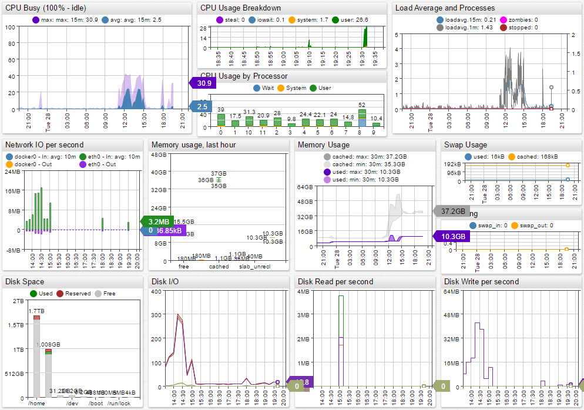

# collectd

collectd is a system statistics daemon that collects operating system performance metrics.

collectd can be configured to stream data into ATSD via TCP or UDP protocol using the `write_atsd` plugin.

See the `write_atsd` plugin [documentation](https://github.com/axibase/atsd-collectd-plugin/blob/master/docs/README.write_atsd.md) for details.

## Installation

### Ubuntu `14.04`

Download package

```sh
wget https://github.com/axibase/atsd-collectd-plugin/releases/download/5.7.2-7/collectd_ubuntu_14.04_amd64.deb
```

Install package

```sh
sudo dpkg -i collectd_ubuntu_14.04_amd64.deb
```

### Ubuntu `16.04`

Download package

```sh
wget https://github.com/axibase/atsd-collectd-plugin/releases/download/5.7.2-7/collectd_ubuntu_16.04_amd64.deb
```

Install package

```sh
sudo dpkg -i collectd_ubuntu_16.04_amd64.deb
```

### CentOS 6.x and RHEL 6.x

Download package

```sh
curl -L --output collectd.rpm \
    https://github.com/axibase/atsd-collectd-plugin/releases/download/5.7.2-7/collectd_rhel_6_amd64.rpm
```

Install package

```sh
sudo yum install collectd.rpm
```

### CentOS 7.x and RHEL 7.x

Download package

```sh
curl -L --output collectd.rpm \
    https://github.com/axibase/atsd-collectd-plugin/releases/download/5.7.2-7/collectd_rhel_7_amd64.rpm
```

Install collectd with utility for managing SELinux policies

```sh
sudo yum install collectd.rpm policycoreutils-python
```

Persist updated SELinux policy to allow TCP connections for collectd

```sh
setsebool -P collectd_tcp_network_connect on
```

## Configuration

Edit the `/etc/collect.conf` file which contains data collection settings.

Modify `AtsdUrl` field by specifying the target ATSD host name or IP address.

Modify the protocol, TCP or UDP, and the port number, if necessary, for example:

```xml
...
<Plugin write_atsd>
     <Node "atsd">
         AtsdUrl "tcp://192.0.2.106:8081"
...
     </Node>
</Plugin>
...
```

```ls
AtsdUrl "tcp://atsd.example.org:8081"
```

```ls
AtsdUrl "udp://192.0.2.106:8082"
```

## Plugin Settings

 **Setting**      | **Description**
------------------|:----------------------------------------
 `AtsdUrl`        | **[Required]** Protocol to transfer data: `tcp` or `udp`<br>Hostname and [port](../../administration/server-properties.md#network) of the target ATSD server.<br>Default ports: `8081` TCP, `8082` UDP.                                                                <br>Default: `tcp://192.0.2.106:8081`
 `Entity`         | Default entity under which all metrics are stored. By default (if setting is left commented out), entity is set to the server hostname.      <br>Default:  `hostname`
  `ShortHostname` | Convert entity from fully qualified domain name to short name                                                                                          <br>Default:  `false`
 `Prefix`         | Metric prefix to group `collectd` metrics                                                                                                              <br>Default:  `collectd`
 `Cache`          | Name of read plugins whose metrics are cached. Cache feature is used to save disk space in the database by not resending the same values.          | `-`
 `Interval`       | Time in seconds during which values within the threshold are not sent.                                                                                 <br>Default:  `-`
 `Threshold`      | Deviation threshold, in %, from the previously sent value. If threshold is exceeded, then the value is sent regardless of the cache interval.          <br>Default:  `-`
 `StoreRates`     | If set to `true`, convert counter values to rates. If set to `false` counter values are stored without changes, for example, as an increasing integer number.               <br>Default:  `true`

More information about collectd configuration is provided in [collectd.conf.5](https://collectd.org/documentation/manpages/collectd.conf.5.shtml) manual page.

## Auto-Start

Enable auto-start for the `collectd-axibase` service.

On Ubuntu `14.04`:

```sh
sudo update-rc.d collectd-axibase defaults 90 10
```

On CentOS `6.x` and RHEL `6.x`:

```sh
sudo chkconfig --add collectd-axibase
```

On Ubuntu `16.04`, CentOS `7.x` and RHEL `7.x`

```sh
sudo systemctl enable collectd-axibase
```

## Manual Start

```sh
sudo service collectd-axibase start
```

```sh
sudo service collectd-axibase status
```

## collectd Portal

Launch live `collectd` Portal in Axibase Chart Lab.

[Launch](https://apps.axibase.com/chartlab/ff756c10)



## Collected Metrics

```elm
collectd.aggregation.cpu.idle
collectd.aggregation.cpu.interrupt
collectd.aggregation.cpu.nice
collectd.aggregation.cpu.softirq
collectd.aggregation.cpu.steal
collectd.aggregation.cpu.system
collectd.aggregation.cpu.user
collectd.aggregation.cpu.wait
collectd.contextswitch.contextswitch
collectd.cpu.cpu.busy
collectd.cpu.cpu.idle
collectd.cpu.cpu.interrupt
collectd.cpu.cpu.nice
collectd.cpu.cpu.softirq
collectd.cpu.cpu.steal
collectd.cpu.cpu.system
collectd.cpu.cpu.user
collectd.cpu.cpu.wait
collectd.df.df_complex.free
collectd.df.df_complex.reserved
collectd.df.df_complex.used
collectd.df.df_inodes.free
collectd.df.df_inodes.reserved
collectd.df.df_inodes.used
collectd.df.percent_bytes.free
collectd.df.percent_bytes.reserved
collectd.df.percent_bytes.used
collectd.df.percent_bytes.used_reserved
collectd.df.percent_inodes.free
collectd.df.percent_inodes.reserved
collectd.df.percent_inodes.used
collectd.disk.disk_io_time.io_time
collectd.disk.disk_io_time.weighted_io_time
collectd.disk.disk_merged.read
collectd.disk.disk_merged.write
collectd.disk.disk_octets.read
collectd.disk.disk_octets.write
collectd.disk.disk_ops.read
collectd.disk.disk_ops.write
collectd.disk.disk_time.read
collectd.disk.disk_time.write
collectd.disk.pending_operations
collectd.entropy.entropy
collectd.interface.if_dropped.rx
collectd.interface.if_dropped.tx
collectd.interface.if_errors.rx
collectd.interface.if_errors.tx
collectd.interface.if_octets.rx
collectd.interface.if_octets.tx
collectd.interface.if_packets.rx
collectd.interface.if_packets.tx
collectd.load.load.longterm
collectd.load.load.midterm
collectd.load.load.shortterm
collectd.memory.memory.buffered
collectd.memory.memory.cached
collectd.memory.memory.free
collectd.memory.memory.slab_recl
collectd.memory.memory.slab_unrecl
collectd.memory.memory.used
collectd.processes.fork_rate
collectd.processes.ps_state.blocked
collectd.processes.ps_state.paging
collectd.processes.ps_state.running
collectd.processes.ps_state.sleeping
collectd.processes.ps_state.stopped
collectd.processes.ps_state.zombies
collectd.swap.swap.cached
collectd.swap.swap.free
collectd.swap.swap.used
collectd.swap.swap_io.in
collectd.swap.swap_io.out
collectd.uptime.uptime
collectd.users.users
collectd.vmem.vmpage_action.dirtied
collectd.vmem.vmpage_action.written
collectd.vmem.vmpage_faults.majflt
collectd.vmem.vmpage_faults.minflt
collectd.vmem.vmpage_io.memory.in
collectd.vmem.vmpage_io.memory.out
collectd.vmem.vmpage_io.swap.in
collectd.vmem.vmpage_io.swap.out
collectd.vmem.vmpage_number.active_anon
collectd.vmem.vmpage_number.active_file
collectd.vmem.vmpage_number.anon_pages
collectd.vmem.vmpage_number.anon_transparent_hugepages
collectd.vmem.vmpage_number.bounce
collectd.vmem.vmpage_number.dirty
collectd.vmem.vmpage_number.dirty_background_threshold
collectd.vmem.vmpage_number.dirty_threshold
collectd.vmem.vmpage_number.file_pages
collectd.vmem.vmpage_number.free_cma
collectd.vmem.vmpage_number.free_pages
collectd.vmem.vmpage_number.inactive_anon
collectd.vmem.vmpage_number.inactive_file
collectd.vmem.vmpage_number.isolated_anon
collectd.vmem.vmpage_number.isolated_file
collectd.vmem.vmpage_number.kernel_stack
collectd.vmem.vmpage_number.mapped
collectd.vmem.vmpage_number.mlock
collectd.vmem.vmpage_number.page_table_pages
collectd.vmem.vmpage_number.shmem
collectd.vmem.vmpage_number.shmem_hugepages
collectd.vmem.vmpage_number.shmem_pmdmapped
collectd.vmem.vmpage_number.slab_reclaimable
collectd.vmem.vmpage_number.slab_unreclaimable
collectd.vmem.vmpage_number.unevictable
collectd.vmem.vmpage_number.unstable
collectd.vmem.vmpage_number.vmscan_immediate_reclaim
collectd.vmem.vmpage_number.vmscan_write
collectd.vmem.vmpage_number.writeback
collectd.vmem.vmpage_number.writeback_temp
collectd.vmem.vmpage_number.zone_active_anon
collectd.vmem.vmpage_number.zone_active_file
collectd.vmem.vmpage_number.zone_inactive_anon
collectd.vmem.vmpage_number.zone_inactive_file
collectd.vmem.vmpage_number.zone_unevictable
collectd.vmem.vmpage_number.zone_write_pending
collectd.vmem.vmpage_number.zspages
```
