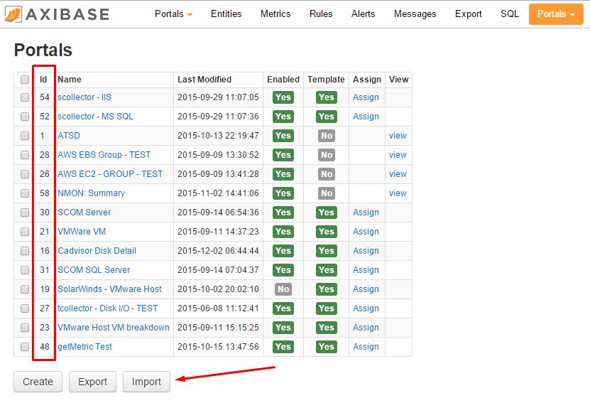
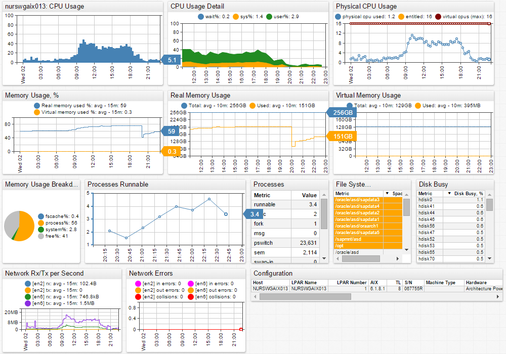

# Visualizing nmon Files in ad-hoc Mode

The Axibase Time Series Database provides ad-hoc visualization of Linux and AIX nmon files.

This means that you can upload any nmon file or an archive of nmon files into ATSD and instantly view the data in a pre-configured portal.

## Execute the Following Steps to Start Visualizing Data from One or Multiple nmon Files

### Download the ad-hoc nmon Portals

nmon Linux:
[https://axibase.com/public/nmon\_Linux.xml](https://axibase.com/public/nmon_Linux.xml)

nmon AIX:
[https://axibase.com/public/nmon\_AIX.xml](https://axibase.com/public/nmon_AIX.xml)

#### Import the portal

This is a one time task.

* Navigate to **Portals > Configure** page.
* At the bottom of the page click "Import" and select either the downloaded `nmon\_AIX` or `nmon\_Linux` portal. If you are collecting data from AIX systems, choose `nmon \_AIX`. If you are collecting data from Linux systems, choose `nmon\_Linux`.
* On the Portals page, keep a note of the unique portal ID that you just imported.

###  Upload the nmon File

* Navigate to **Configuration > Parsers: nmon**
* At the bottom of the page, click "Upload" to import your nmon file or archive of nmon files using the "default" nmon parser.
* Keep a note of the hostname for which you have just uploaded the data.

You can learn more about uploading nmon files into ATSD
[here](https://axibase.com/products/axibase-time-series-database/writing-data/nmon/file-upload/).

### View the Data

* Navigate to the below URL. Replace **atsd\_server** with your ATSD url, **hostname** with the hostname for which you have uploaded the nmon file, and **portal\_id** with your portal ID:

    https://**atsd\_host**:8443/portal/tabs?entity=**hostname**&id=**portal\_id**

