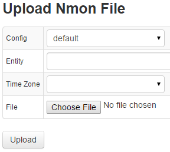

#File Upload

Uploading `nmon` files can be done using a `wget` command or using the ATSD user interface.

Below are the commands and settings for uploading `nmon` files using a `wget` command.

**Plain**

```sh
wget --header="Content-type: text/csv" --post-file=file.nmon 'http://server:port/nmon/wget?config=config_name&amp;entity=entity_name&amp;timeZone=time_zone_id'
```

**Gzip**

```sh
wget --header="Content-type: text/csv" --header="Content-Encoding: gzip" --post-file=file.nmon.gz 'http://server:port/nmon/wget?config=config_name&amp;entity=entity_name&amp;timeZone=time_zone_id'
```

## Special Parameters

* `config` (required) – name of nmon parser configuration in ATSD.
* `entity` (optional) – name of entity. If left blank, the parser will use the host record from the [nmon header](headers.md "Headers") as the entity name.
* `timeZone` (optional) – time zone where the data was recorded.

Multiple `nmon` files can be uploaded simultaneously if archived. It is possible for the archive to contain `nmon` files from multiple hosts. In this case, leave the entity field blank and the parser will use the host record from the [nmon header](headers.md "Headers") as the entity name.

## Supported Compression Formats

> .zip, .tar, .tar.gz, .tar.bz2

## Below is a Screenshot of nmon File User Interface Upload


