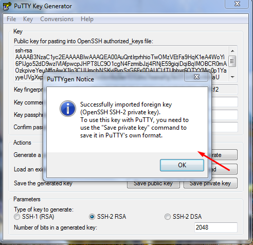
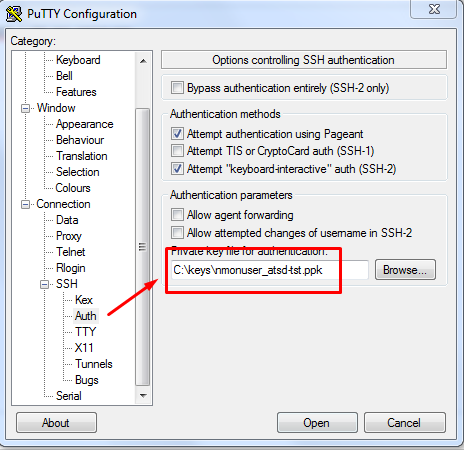

# SSH Tunnel Setup

## User Guide for Setting up an SSH Tunnel

Start by creating a read-only account on the ATSD server as described in the [User Account Setup Guide](ssh-user.md).

The guide uses `atsd-tst` as the hostname of the ATSD server.

The guide uses `nurswgvml001` as the hostname of the remote system.

In the guide, `-p` specifies the TCP port of the ATSD server. Indicate the correct available port. For example: `-p 22`.

Copy the `/opt/atsd/id_rsa_atsdreadonly` key generated during ATSD installation (or the one created using our [User Account Setup Guide](ssh-user.md)) to a remote system into the directory `/opt/nmon`.

Add the ATSD host to known hosts on the target server:

```sh
ssh-keyscan -H atsd-tst >> ~/.ssh/known_hosts
```

On Unix systems, the permissions to the key file must not allow any access to world and group. You can achieve this with the command `chmod 0600`. If the permissions are less strict, the file is ignored and the SSH tunnel fails to start.

Set the permissions and ownership for the user account on remote servers. `root` privileges are not necessary.

Ensure you have the ownership rights for the ssh key:

```sh
ls -l /opt/nmon/id_rsa_atsdreadonly
```

Change ownership:

```sh
sudo chown {currentuser} /opt/nmon/id_rsa_atsdreadonly
```

Change permissions:

```sh
sudo chmod 0600 /opt/nmon/id_rsa_atsdreadonly
```

## Test SSH connection

```sh
ssh atsdreadonly@atsd-tst -i /opt/nmon/id_rsa_atsdreadonly -p 22
```

## Open SSH tunnel

```sh
ssh -fN -L `hostname`:10000:localhost:8081 atsdreadonly@atsd-tst -i /opt/nmon/id_rsa_atsdreadonly -p 22
```

In the above example, the tunnel is established between local port 10000 on the remote system and local port 8081 on the ATSD server.

If the tunnel is not established, check if you can `ping` the ATSD server to see if the port is available and if the username and ssh key are set correctly.

### Verify that the SSH tunnel is active

```sh
ps -ef | grep ssh
```

The output contains the following line:

```sh
user001 31326 1 0 17:30 ? 00:00:00 ssh -fN -L nurswgvml001:10000:localhost:8081 atsdreadonly@atsd-tst -i /opt/nmon/id_rsa_atsdreadonly
```

This output means that the SSH tunnel is successfully established.

### Stop the SSH tunnel (using the pid from the output above)

```sh
kill 31326
```

## Verify the connectivity from a Windows machine (optional step)

Load `id_rsa_atsdreadonly` into the `puttygen` program



Click **Save private key** and save the file in `*.ppk` format to the local disk

Open the `putty` client and connect it to the ATSD server under `atsdreadonly` with the `ppk` file



Copy private key to remote systems

Distribute the generated private key `/opt/atsd/id_rsa_atsdreadonly` to remote systems collecting `nmon` data.

Disable login by ssh

This step disables the remote shell for `atsdreadonly`, however, it retains the tunneling capability.

```sh
sudo nano /etc/passwd
```

Search for `nmonuser` entry and replace the shell command as follows

```sh
atsdreadonly:x:1004:1004:,,,:/home/atsdreadonly:/bin/bash
```

```sh
atsdreadonly:x:1004:1004:,,,:/home/atsdreadonly:/bin/false
```

Verify that you are no longer able to log in to ATSD server with `nmonuser` credentials

```sh
ssh atsdreadonly@atsd-tst -i /opt/nmon/id_rsa_atsdreadonly -p 22
```

If the `atsdreadonly` shell environment is not available, then the remote login is successfully disabled
