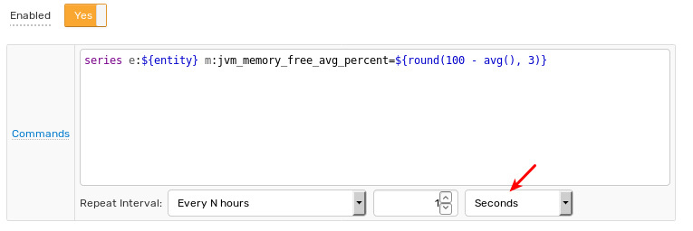

# Derived Commands

## Overview

Derived command actions store new calculated metrics in the database by creating and processing custom commands defined by [Network API](../api/network/README.md#network-api) syntax.

## Command Template

To configure a command action, specify a template which contains a command name, command fields and command values.

### Supported Commands

* [`series`](../api/network/series.md)
* [`property`](../api/network/property.md)
* [`message`](../api/network/message.md)
* [`entity`](../api/network/entity.md)
* [`metric`](../api/network/metric.md)

### Fields

Command templates can include plaintext and [placeholders](placeholders.md).

```bash
series e:${entity} m:jvm_memory_free_avg_percent=${round(100 - avg(), 3)}
```

Calculated metrics can reference other metrics using [`db_last`](functions-series.md#db_last), [`db_statistic`](functions-series.md#db_statistic), and [`value`](functions-value.md#value) functions.

```bash
series e:${entity} m:jvm_memory_used_bytes=${value * db_last('jvm_memory_total_bytes') / 100.0}
```

```bash
series e:${entity} m:${metric}_percent=${value / value('total') * 100.0} ms:${timestamp}
```

### Tags

A special placeholder `${commandTags}` is provided to print out all command tags in the [Network API](../api/network/series.md#syntax) syntax. Use it to append all tags to the command without knowing tag names in advance.

```bash
series e:${entity} m:disk_free=${100 - value} ${commandTags} ms:${timestamp}
```

The above expression transforms the input command into a derived command as follows:

**Input**:

```ls
series e:test m:disk_used=25 t:mount_point=/ t:file_system=sda ms:1532320900000
```

**Derived**:

```ls
series e:test m:disk_free=75 t:mount_point=/ t:file_system=sda ms:1532320900000
```

In addition to including specific command tags by name, use the  `${commandTags}` placeholder to copy all tags in the received command.

| Command | Example |
|---|---|
| Input | `series e:server-01 m:du=25 t:mp=/ t:file_system=sda` |
| Template | `series e:${entity} m:df=${100 - value} ${commandTags}` |
| Derived | `series e:server-01 m:df=75 t:mp=/ t:file_system=sda` |

### Time

#### Current Server Time

To store derived commands with current server time, omit date fields (`ms`, `s`, `d`) from the derived command.

```bash
series e:${entity} m:disk_free=${100 - value} ${commandTags}
```

Alternatively, use the [`now`](window-fields.md#date-fields) placeholder to access current server time.

```bash
series e:${entity} m:disk_free=${100 - value} ${commandTags} ms:${now.millis}
```

To store commands with second precision, round the current time using [`floor`](functions.md#mathematical) function and `s:` seconds parameter:

```bash
series e:${entity} m:disk_free=${100 - value} ${commandTags} s:${floor(now.millis/1000)}
```

#### Received Time

To store a derived command with the same time as an incoming command, set `ms:` millisecond parameter to [`${timestamp}`](window-fields.md#date-fields). This placeholder represents the timestamp of the command that triggered the window status event.

```bash
series e:${entity} m:disk_free=${100 - value} ${commandTags} ms:${timestamp}
```

> If **Check on Exit** is turned on, some status change events are caused by oldest commands being removed from the window. In such cases the `timestamp` field contains the time of the existing command, rounded to seconds.

To round the input time to seconds, use `s:` seconds parameter and [`floor`](functions.md#mathematical) function:

```bash
series e:${entity} m:disk_free=${100 - value} ${commandTags} s:${floor(timestamp/1000)}
```

## Frequency

Store derived commands each time a command is received or removed from the window by setting the **Repeat** parameter to **All**.

Decrease frequency by adjusting the repeat interval.



Produced commands are queued in memory and persisted to the database once per second.

## Multiple Commands

Specify multiple commands, including those of different types, at the same time. Each command must be specified on a separate line.

```bash
series e:${entity} m:jvm_memory_free_avg_percent=${round(100 - avg(), 3)}
series e:${entity} m:jvm_memory_free_min_percent=${round(100 - max(), 3)}
```

To create multiple metrics within the same command, use a `for` loop to iterate over a collection or array.

```bash
series e:${entity} @{s = ""; for (stat : stats) {s = s + " m:" + stat.split(":")[0] + "=" + stat.split(":")[1];} return s;}
```

If the `stats` collection is `['a:10', 'b:20', 'c:30']`, the produced command is inserted as shown below:

```ls
series e:entity1 m:a=10 m:b=20 m:c=30
```

## Condition

If the purpose of a rule is to create derived series, without any alerting, set the `Condition` field to a static `true` value to minimize processing overhead.


## Examples

### Moving Average, Last `n` Count

* Window Size: `count = 10`
* Condition: `true`
* Derived Command:

  ```bash
  series e:${entity} m:${metric}_movavg=${avg()} ${commandTags}
  ```

### Moving Average, Last `n` Time

* Window Size: `time = 10 minute`
* Condition: `true`
* Derived Command:

  ```bash
  series e:${entity} m:${metric}_movavg=${avg()} ${commandTags}
  ```

### Roll Up (All Matching Entities)

* Window Type: `time:  1 minute`
* Group by Entity: Not Enabled
* Condition: `true`
* Derived Command:

  ```bash
  series e:total m:${metric}_sum=${sum()}
  ```

### Reverse / Inverse Metric

* Window Type: `count = 1`
* Condition: `true`
* Derived Command:

  ```bash
  series e:${entity} m:${metric}_rev=${100-value} ${commandTags}
  ```

  ```bash
  series e:${entity} m:${metric}_inv=${value = 0 ? 0 : 1/value} $  {commandTags}
  ```

### Ratio / Percentage

* Window Type: `count =  1`
* Condition: `true`
* Derived Command:

  ```bash
  series e:${entity} m:${metric}_percent=${100 * value/value('total')} $  {commandTags}
  ```

### Message to Series

* Window Type: `count = 1`
* Condition: `true`
* Derived Command:

  ```bash
  series e:${entity} m:job_execution_time=$  {tags.job_execution_time.replaceAll("[a-zA-Z]", "").trim()}
  ```
