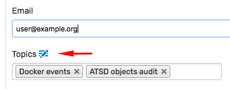
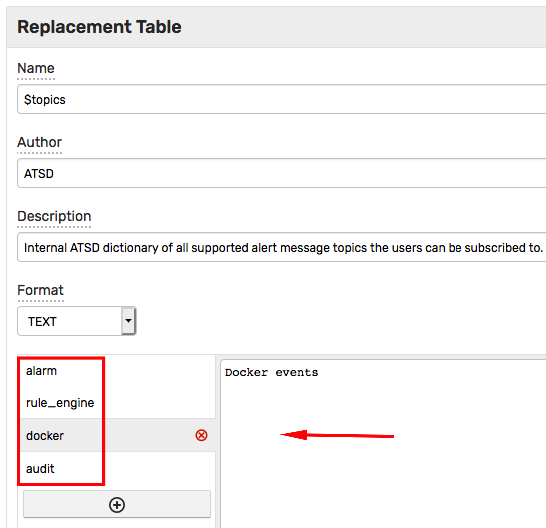

# Lookup Functions

## Overview

These functions retrieve collections and maps of strings from named collections, replacement tables, and other database tables.

Replacement tables are listed on the **Data > Replacement Tables** page.

Named collections are listed on the **Data > Named Collections** page.

## Reference

* [`collection`](#collection)
* [`lookup`](#lookup)
* [`replacementTable`](#replacementtable)
* [`entity_tag`](#entity_tag)
* [`entity_tags`](#entity_tags)
* [`entity_label`](#entity_label)
* [`getEntity`](#getentity)
* [`getEntities`](#getentities)
* [`getEntityCount`](#getentitycount)
* [`getEntityName`](#getentityname)
* [`get_group_emails`](#get_group_emails)
* [`subscribers`](#subscribers)

### `collection`

```csharp
collection(string name) [string]
```

Retrieves a list of strings for the specified collection identified by `name`. Named collections are listed on the **Data > Named Collections** page.

If no collection is found, the function returns an empty list.

```javascript
tags.location NOT IN collection('dc-locations')
```

```javascript
collection('dc-locations').contains(tags.location)
```

To check the size of the list, use the `.size()` method.

To access the `n`-th element in the collection, use square brackets `[index]` or the `get(index)` method (starting with `0` for the first element).

```javascript
author = (authors.size() == 0) ? 'n/a' : authors[0]
```

### `lookup`

```csharp
lookup(string name, string key[, bool def]) string
```

Returns the value for key `key` from the replacement table identified by `name`.

The function returns an empty string if the table is not found or if the table does not contain the specified key.

If the optional boolean `def` parameter is specified and is set to `true`, the function returns the original argument key in case the table is not found or if the key is not found.

Example:

```javascript
/* Returns 'john.doe' if the 'on-call' table does not contain an entry for 'john.doe' */
lookup('on-call', 'john.doe', true)
```

### `replacementTable`

```csharp
replacementTable(string name) map
```

Retrieves the replacement table identified by `name` as a key-value map.

If the table is not found, the function returns an empty map.

```javascript
// .keySet() returns a collection of keys in the replacement table
replacementTable('oncall-emails').keySet()
```

```javascript
// .values() returns a collection of values in the replacement table
replacementTable('oncall-emails').values()
```

```javascript
// returns a random value in the replacement table
randomItem(replacementTable('oncall-emails').values())
```

```javascript
// returns a random key-value object from the replacement table
randomItem(replacementTable('oncall-emails'))
```

### `entity_tag`

```csharp
entity_tag(string entity, string name) string
```

Returns value of tag `name` for entity `entity`.

If the tag or the entity is not found, an empty string is returned.

### `entity_tags`

```csharp
entity_tags(string entity [, bool format]) map
```

Returns entity tags for entity `entity` as a map.

If the entity is not found, the function returns an empty map.

If the optional format argument `format` is set to `true`, the tag names in the map are converted to labels using the applicable entity tag templates which are listed on the **Settings > Tag Templates** page.

To exclude specific tags from the results, use the `excludeKeys()` function:

```javascript
excludeKeys(entity_tags(ent), ['image', 'java.home'])
```

Example:

```javascript
entity_tags('08ac68c080bc2829f9c924949c86f65d2140c3f1253f3510f8a4e2e4d5219e2b')
```

```txt
+-------------------------+----------------------------------------------+
| Name                    | Value                                        |
+-------------------------+----------------------------------------------+
| hostname                | 08ac68c080bc                                 |
| image-name              | jmeter                                       |
| image-repotags          | axibase/jmeter:latest                        |
| image-tags              | latest                                       |
| ip-address              | 172.17.0.18                                  |
...
```

```javascript
entity_tags('08ac68c080bc2829f9c924949c86f65d2140c3f1253f3510f8a4e2e4d5219e2b', true)
```

```txt
+-------------------------+----------------------------------------------+
| Name                    | Value                                        |
+-------------------------+----------------------------------------------+
| IP Address              | 172.17.0.18                                  |
| Hostname                | 08ac68c080bc                                 |
| Image Name              | jmeter                                       |
| Image Tags              | latest                                       |
| Image Repo Tags         | axibase/jmeter:latest                        |
...
```

### `entity_label`

```csharp
entity_label(string entity) string
```

Returns label for entity `entity`.

If the entity is not found or the entity does not have a label, the argument `entity` is returned.

### `getEntity`

```csharp
getEntity(string entity [,bool matchLabel]) Entity
```

Retrieves an entity object by name. If `matchLabel` set to `true` entity is searched by label if `entity` is not found by name. By default `matchLabel` is `false`.

Access `Entity` object [fields](entity-fields.md) using dot notation, for example `getEntity('nurswgvml007').label`.

The function returns `null` if the entity is not found.

Example:

```javascript
/* Returns an interpolation mode of 'nurswgvml007' entity object */
getEntity('nurswgvml007').interpolate
```

### `getEntities`

```csharp
getEntities(string metric, string startDate, string endDate, string expr) [Entity]
```

Returns a list of [Entity](entity-fields.md) **objects** with last insert date for metric `metric` between `startDate` and `endDate` and matching the specified expression `expr`.

Expression `expr` can include entity [fields](../api/meta/entity/list.md#fields) (except `lastInsertDate`) and [window fields](window.md#window-fields). Refer to entity [fields](entity-fields.md) using dot notation.

Start date `startDate` and end date `endDate` are [ISO format](../shared/date-format.md) dates or a [calendar keyword](../shared/calendar.md#keywords).

To access the `n`-th object in the list, use square brackets `[index]` or `get(index)` method, starting with `0` for the first element.

Examples:

```javascript
entities = getEntities('docker.activecontainers', 'now - 1 * HOUR', 'now', "tags.status != 'deleted'")
// entities[0].name
// date_format(entities.get(0).lastInsertTime, "yyyy-MM-dd HH:mm:ss", "UTC")
```

* Match using entity object field

```javascript
getEntities('df.inodes.used', '2018-01-13T18:08:04Z', '2018-02-13T18:08:04Z', "enabled=true")
```

* Match using wildcard

```javascript
getEntities('jvm_memory_used', 'now - 4*YEAR', 'now', "tags.alias LIKE '00*'")
```

* Match using window field

```javascript
getEntities('cpu_busy', 'yesterday', 'now', "interpolate = 'LINEAR' && tags.app = '" + entity.tags.app + "'")
```

### `getEntityCount`

```csharp
getEntityCount(string metric, string startDate, string endDate, string expr) int
```

Returns a count of [Entity](entity-fields.md) **objects** with last insert date for metric `metric` between `startDate` and `endDate` and matching the specified expression `expr`.

Identical to `getEntity(metric, startDate, endDate, expr).size()`.

### `getEntityName`

```csharp
getEntityName(string entity) string
```

Returns normalized (lowercase) entity name for input string `entity`. The function searches for entity by name `entity` in a case-insensitive manner. If the entity is not found by name, the function attempts to find an entity by label `entity` in a case-insensitive manner.

If the entity cannot be found, the function returns the original `entity` argument.

### `get_group_emails`

```csharp
get_group_emails(string user_group) list
```

Returns the list of email addresses of active (non-locked) members of the specified user group.

```csharp
${get_group_emails('Dev Ops')}
```

### `subscribers`

```csharp
subscribers(string topic_name_1 [, string topic_name_2]) list
```

Returns the list of email addresses for users who have subscribed to the specified topic on their personal user account pages.



```csharp
${subscribers('docker', 'audit')}
```

The list of topics is managed by an administrator as a replacement table at `https://atsd:8443/replacement-tables/%24topics`.

