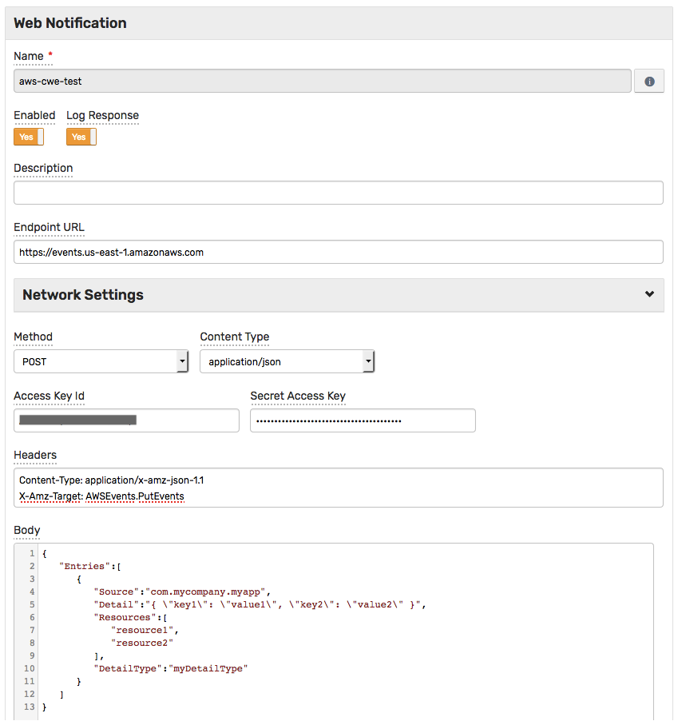
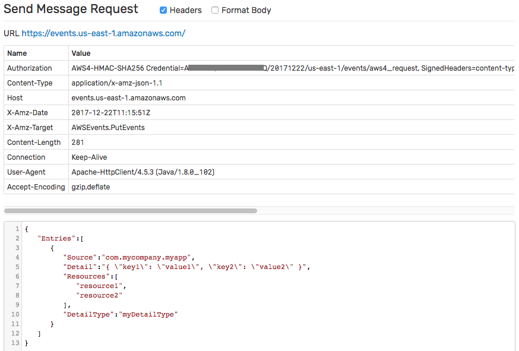
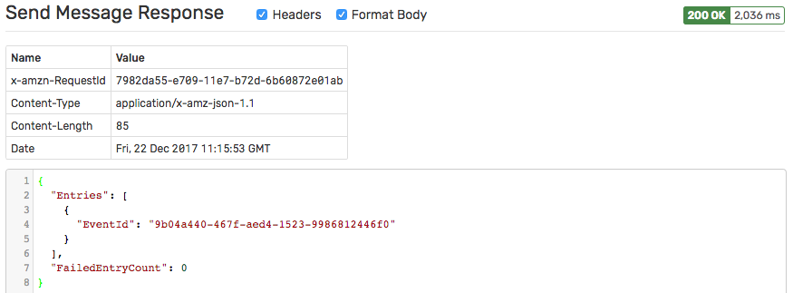

# Integration with Amazon CloudWatch Events

## Overview

The following example demonstrates how to create an [Amazon CloudWatch](https://aws.amazon.com/cloudwatch) event using a [`AWS API`](aws-api.md) webhook.

The request is automatically signed with **AWS Signature, v4**, implemented by this webhook type, which allows submitting requests to **any** AWS endpoint that accepts **AWS Signature, v4**.

The example invokes the [Amazon CloudWatch Events API](https://docs.aws.amazon.com/AmazonCloudWatchEvents/latest/APIReference/API_PutEvents.html) `PutEvents` action.

## Configuration

Create a new `AWS API` webhook or import the [template](./resources/aws-api-cwe-notification.xml) used in this example. To import the XML template file, open the **Alerts > Outgoing Webhooks** page, select **Import** in the split button located below the table and complete the upload form.

To create a new webhook, open the **Alerts > Outgoing Webhooks** page and click **Create**.

### Parameters

Enter a name and specify the following parameters:

| **Name** | **Value** |
| :--- | :--- |
| Endpoint URL | `https://events.<AWS_REGION>.amazonaws.com` |
| Method | `POST` |
| Content Type | `application/json` |
| Access Key Id | `<AWS_ACCESS_KEY_ID>` |
| Secret Access Key | `<AWS_SECRET_ACCESS_KEY>` |
| Body | `<MESSAGE_TEXT>` |

Modify the `Endpoint URL` by replacing the `<AWS_REGION>` value with your [Amazon CloudWatch Events region](https://docs.aws.amazon.com/general/latest/gr/rande.html#cwe_region), for example:

```elm
https://events.us-east-1.amazonaws.com
```

Enter the AWS key id into the `Access Key Id` field and the secret key into the `Secret Access Key` field.

Add required headers for `PutEvents` action:

| **Name** | **Value** |
| :--- | :--- |
| `Content-Type` | `application/x-amz-json-1.1` |
| `X-Amz-Target` | `AWSEvents.PutEvents` |

Modify the `Body` by replacing the `<MESSAGE_TEXT>` value with your text, for example:

```json
{
   "Entries":[
      {
         "Source":"com.mycompany.myapp",
         "Detail":"{ \"key1\": \"value1\", \"key2\": \"value2\" }",
         "Resources":[
            "resource1",
            "resource2"
         ],
         "DetailType":"myDetailType"
      }
   ]
}
```



Click **Test**.




