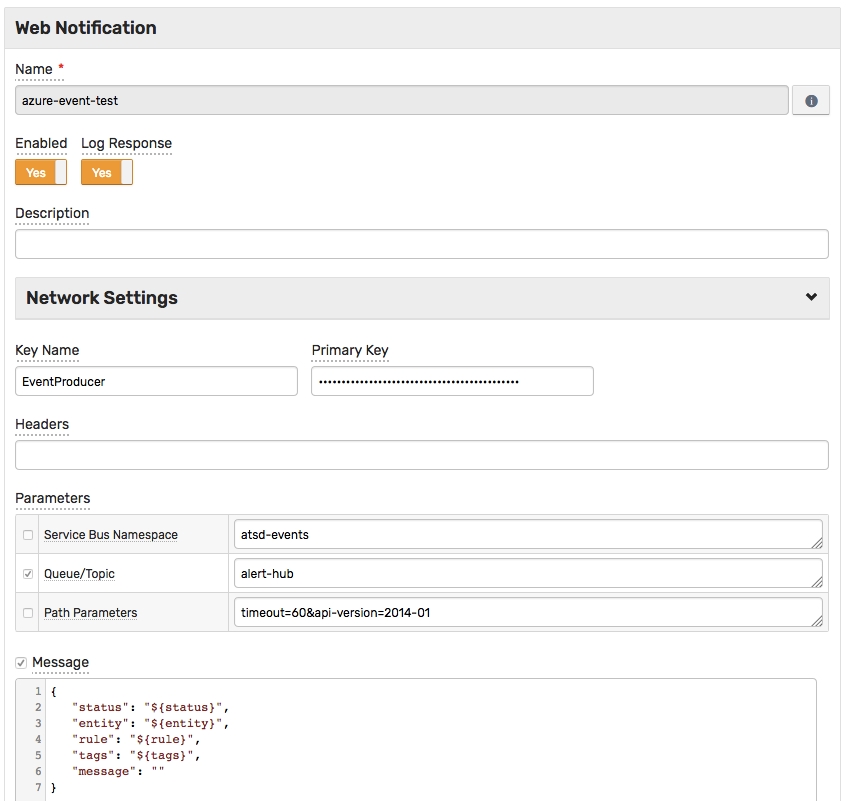
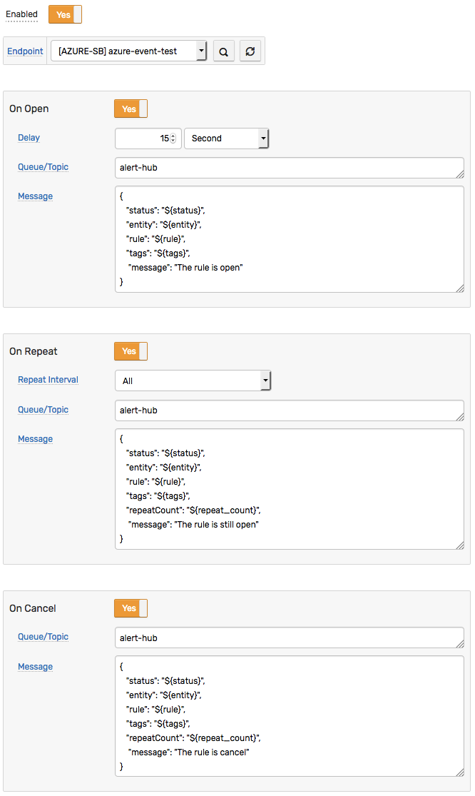

## Azure Send Event Example

## Overview

The following example demonstrates how to send a new event to a [Azure Event Hub](https://azure.microsoft.com/en-us/services/event-hubs/) using a [`AZURE SB`](azure-sb.md) web notification.

The example invokes the [Azure Event Hub API](https://docs.microsoft.com/en-us/rest/api/eventhub/send-event) `Send Event` action.

## Configuration

Create a new `AZURE SB` web notification or import the [template](resources/azure-sb-event-notification.xml) used in this example. To import the XML template file, open the **Alerts > Web Notifications** page, select **Import** in the multi-action button located below the table and follow the prompts.

To create a new notification, open the **Alerts > Web Notifications** page and click **Create**.

### Parameters

Enter a name and specify the following parameters:

| **Name** | **Value** |
| :--- | :--- |
| Key Name | `<KEY_NAME>` |
| Primary Key | `<PRIMARY_KEY>` |
| Service Bus Namespace | `<EVENT_HUB_NAMESPACE>` |
| Queue/Topic | `<EVENT_HUB>` |
| Path Parameters | `timeout=60&api-version=2014-01` |
| Message | `<MESSAGE_TEXT>`|

Enter the Azure key name into the `Key Name` field and the primary key into the `Primary Key` field.

Modify the `Service Bus Namespace` by replacing the `<EVENT_HUB_NAMESPACE>` value with your namespace, for example:

```txt
atsd-events
```

Modify the `Queue/Topic` by replacing the `<EVENT_HUB>` value with your hub name, for example:

```txt
alert-hub
```

Modify the `Message` by replacing the `<MESSAGE_TEXT>` value with your text, for example:

```json
{
   "status": "${status}",
   "entity": "${entity}",
   "rule": "${rule}",
   "tags": "${tags}",
   "message": ""
}
```

The `Message` text contains placeholders that will be substituted with actual values when the notification is triggered. The placeholders specified in the message are visible as editable parameters in the rule editor.



## Rule

Create a new rule or import the [rule template](resources/azure-sb-event-rule.xml) used in this example. To import the XML template file, open the **Alerts > Rules** page, select **Import** in the multi-action button located below the table and follow the prompts.

To create a new rule, open the **Alerts > Rules** page and click **Create**.

Specify the key settings on the **Overview** tab.

| **Name** | **Value** |
| :-------- | :---- |
| Status | Enabled |
| Metric | test_m |
| Condition | `value > 1` |


Open the **Web Notifications** tab.

Set **Enabled** to **Yes** and choose the previously created web notification from the **Endpoint** drop-down.

Enable **Open**, **Repeat** and **Cancel** triggers.

Specify the message text into the `Message` parameter for all triggers.



## Test

Test the integration by submitting a sample `series` command on the **Data > Data Entry** page.

```ls
  series e:test_e m:test_m=2
```


The value will cause the condition to evaluate to `true`, which in turn will trigger the notification.
To verify that an alert was raised, open **Alerts > Open Alerts** page and check that an alert for the `test_m` metric is present in the **Alerts** table.


Check the Azure Event Hub to make sure the new messages were received:


