# IFTTT Integration

## Overview

The following example demonstrates how to trigger an action in [IFTTT](https://ifttt.com/) using a [`CUSTOM`](custom.md) webhook in the ATSD rule engine.

This type of integration relies on the [IFTTT Webhook](https://ifttt.com/maker_webhooks) trigger.

## Create IFTTT Applet

Log in to [ifttt.com](https://ifttt.com) and go to **My Applets**.


Click **New Applet**.


Click **(+) this** to create a trigger.

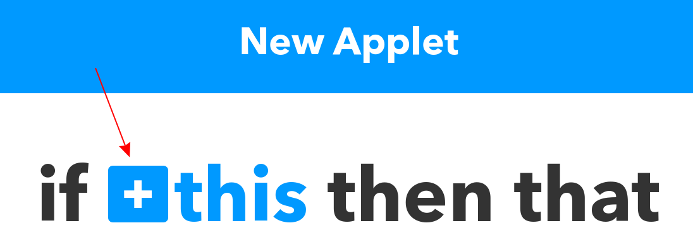

Search for **Webhooks** and select it.

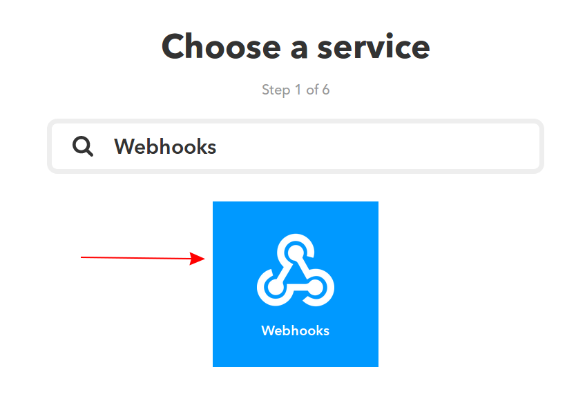

Click **Connect** to set up a webhook trigger.


Choose **Receive a web request**.

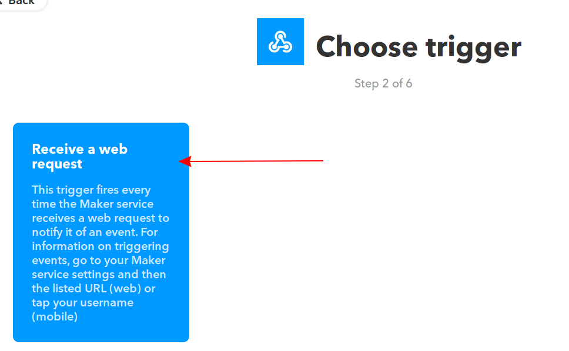

Enter an event name such as **atsd_custom_trigger** and click **Create trigger**.

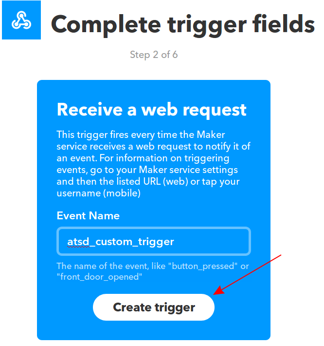

Click **(+) that** to create a event.


Search for **SMS** and select it.

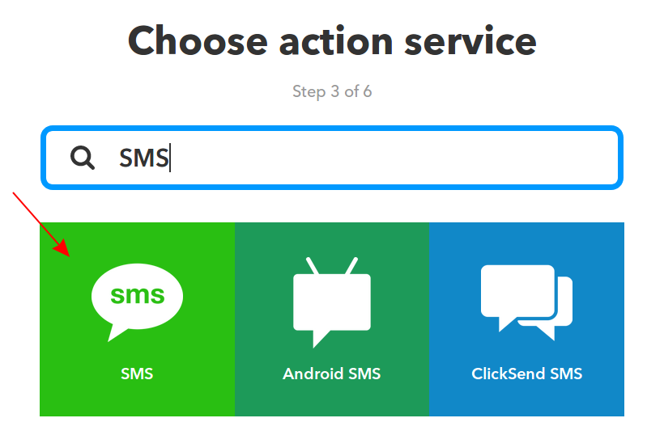

Click **Connect** to setup event.


Enter a phone number to receive messages from ATSD and click **Send PIN**. Check your device and enter the PIN you've received. Click **Connect**.

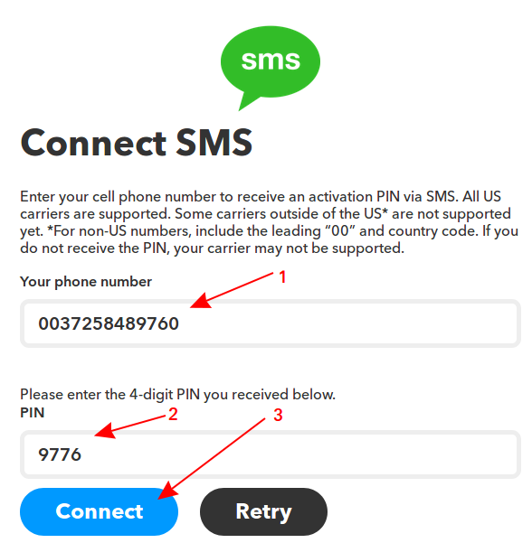

Choose **Send me an SMS**.

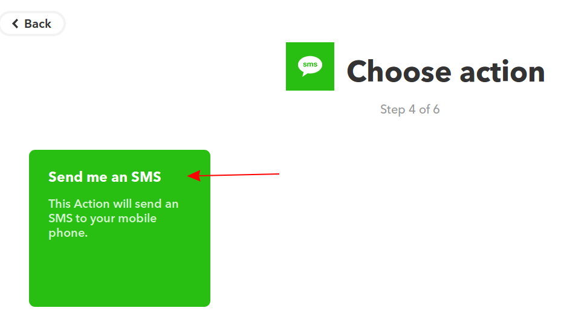

Enter following text into **Message** field and click **Create action**.

```ls
[{{Value1}}] {{Value2}} for {{Value3}}
```

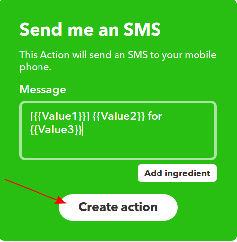

Review changes and click **Finish**.

## Configuration

Create a new `CUSTOM` webhook or import the [template](./resources/custom-ifttt-notification.xml) used in this example. To import the XML template file, open the **Alerts > Outgoing Webhooks** page, select **Import** in the split button located below the table and follow the prompts.

To create a new notification, open the **Alerts > Outgoing Webhooks** page and click **Create**.

### Parameters

Enter a name and specify the following parameters:

| **Name** | **Value** |
| :--- | :--- |
| Method | `POST` |
| Content Type | `application/json` |
| Authentication | `None` |
| Endpoint URL | `https://maker.ifttt.com/trigger/${webhook_name}/with/key/<IFTTT_KEY>` |

Modify the `Endpoint URL` by replacing the `<IFTTT_KEY>` field with the IFTTT webhook token.

The `Endpoint URL` may look as follows: `https://maker.ifttt.com/trigger/${webhook_name}/with/key/111111`

You can find your IFTTT token in the `Webhooks` examples. Go to [Webhooks](https://ifttt.com/maker_webhooks) and select **Documentation**.

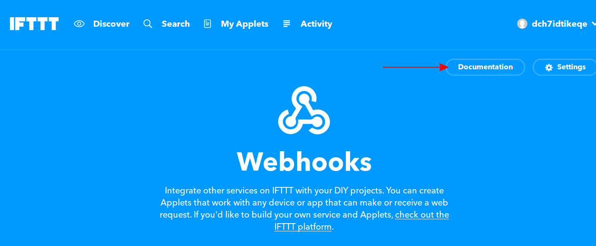

Copy the key.


Keep the `${webhook_name}` placeholder in the URL path so that it can be customized in the rule editor. This allows you to send SMS messages from different applets using the same webhook.

### Payload

Enter the following text into the `Body` field:

```json
{
  "value1": "${status}",
  "value2": "${rule}",
  "value3": "${entity}"
}
```

The `body` text contains placeholders that are substituted with actual values when the notification is triggered.

Only `valueN` naming convention for JSON fields is supported by the IFTTT platform.

The placeholders specified in the payload and the URL are visible as editable parameters in the rule editor.

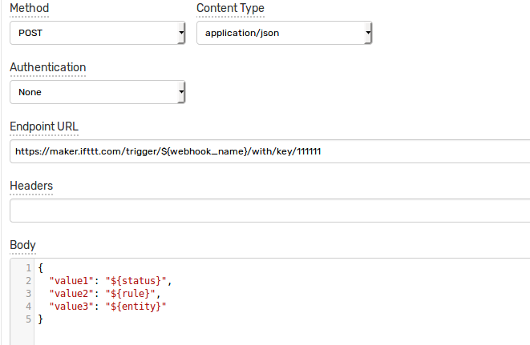

## Rule

Create a new rule or import the [rule template](./resources/custom-ifttt-rule.xml) used in this example. To import the XML template file, open the **Alerts > Rules** page, select **Import** in the split button located below the table and follow the prompts.

To create a new rule, open the **Alerts > Rules** page and click **Create**.

Specify the key settings on the **Overview** tab.

| **Name** | **Value** |
| :-------- | :---- |
| Status | Enabled |
| Metric | test_m |
| Condition | `value > 1` |

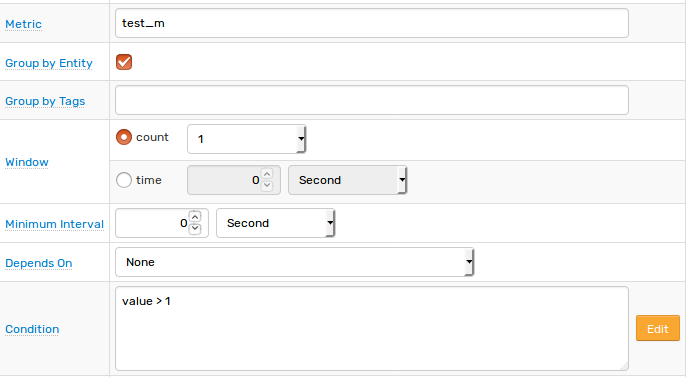

Open the **Webhooks** tab.

Set **Enabled** to **Yes** and choose the previously created webhook from the **Endpoint** drop-down.

Enable **Open**, **Repeat** and **Cancel** triggers. Set the **Repeat Interval** to **All**.

Specify the webhook identifier `atsd_custom_webhook` in the `webhook_name` parameter for all triggers.

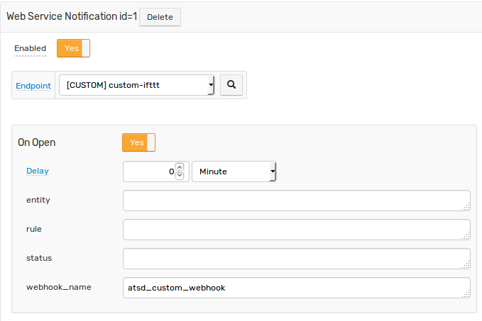

The `webhook_name` placeholder in the request URL as well as payload placeholders are automatically resolved when the notification is triggered:

`https://maker.ifttt.com/trigger/atsd_custom_trigger/with/key/111111`

```json
{
  "value1": "OPEN",
  "value2": "IFTTT",
  "value3": "test_e"
}
```

## Test

Test the integration by submitting a sample `series` command on the **Data > Data Entry** page.

```ls
  series e:test_e m:test_m=2
```


The value causes the condition to evaluate to `true`, which in turn triggers the notification.
To verify that an alert was raised, open **Alerts > Open Alerts** page and check that an alert for the `test_m` metric is present in the **Alerts** table.


Check your device to make sure the SMS was received.
