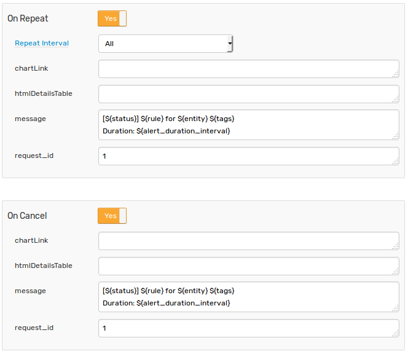
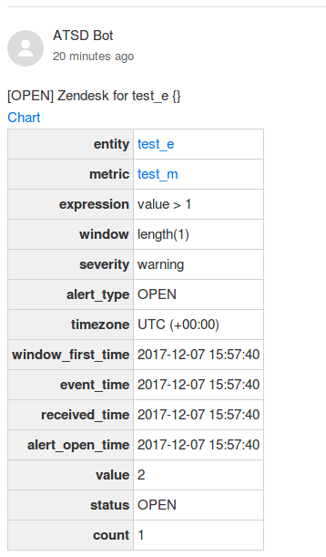

# Zendesk Integration

## Overview

The following example demonstrates how to add a comment to an existing request / ticket in [Zendesk](https://www.zendesk.com/) using a [`CUSTOM`](custom.md) webhook in the ATSD rule engine.

This integration relies on the [Zendesk API](https://developer.zendesk.com/rest_api/docs/core/requests#update-request) `update-request` method.

## Configuration

Create a new `CUSTOM` webhook or import the [template](./resources/custom-zendesk-notification.xml) used in this example. To import an XML template file, open the **Alerts > Outgoing Webhooks** page, select **Import** in the split button located below the table and follow the prompts.

To create a new notification, open the **Alerts > Outgoing Webhooks** page and click **Create**.

### Parameters

Enter a name and specify the following parameters:

| **Name** | **Value** |
| :--- | :--- |
| Method | `PUT` |
| Content Type | `application/json` |
| Authentication | `Basic` |
| Username | `<ZENDESK_USER>` |
| Password | `<ZENDESK_PASSWORD>` |
| Endpoint URL | `https://<COMPANY_NAME>.zendesk.com/api/v2/requests/${request_id}.json` |

Modify the `Endpoint URL` by replacing the `<COMPANY_NAME>` field with your Zendesk subdomain.

The `Endpoint URL` may look as follows: `https://axibase.zendesk.com/api/v2/requests/${request_id}.json`

Keep the `${request_id}` placeholder in the URL path so that the request id is customizable in the rule editor. This allows you to add comments to different requests using the same webhook.

Enter the Zendesk user name into the `Username` field and the password into the `Password` field.

### Payload

Enter the following text into the `Body` field:

```json
{
  "request": {
    "comment": {
      "html_body": "${message}<br><a href=${chartLink}>Chart</a><br>${htmlDetailsTable}"
    }
  }
}
```

The `html_body` text contains placeholders that are substituted with actual values when the notification is triggered.

Placeholders specified in the payload and the URL are visible as editable parameters in the rule editor.


## Rule

Create a new rule or import the [rule template](./resources/custom-zendesk-rule.xml) used in this example. To import the XML template file, open the **Alerts > Rules** page, select **Import** in the split button located below the table and follow the prompts.

To create a new rule, open the **Alerts > Rules** page and click **Create**.

Specify the key settings on the **Overview** tab.

| **Name** | **Value** |
| :-------- | :---- |
| Status | Enabled |
| Metric | test_m |
| Condition | `value > 1` |


Open the **Webhooks** tab.

Set **Enabled** to **Yes** and choose the previously created webhook from the **Endpoint** drop-down.

Enable **Open**, **Repeat** and **Cancel** triggers. Set the **Repeat Interval** to **All**.

Specify the Zendesk request identifier into the `request_id` parameter for all triggers. The request must already exist in the Zendesk system for the entry to be valid.

To override the default `message` parameter which is set to  `[${status}] ${rule} for ${entity} ${tags}`, enter a new value, for example `[${status}] ${rule} for ${entity} ${tags}`<br>`Duration: ${alert_duration_interval}`.



The request ID placeholder in the request URL as well as payload placeholders are automatically resolved when the notification is triggered:

`https://axibase.zendesk.com/api/v2/requests/1.json`

```json
{
  "request": {
    "comment": {
      "html_body": "[OPEN] Zendesk for test_e {}<br><a href="chart link">Chart</a><br><table>... alert table</table>"
    }
  }
}
```

## Test

Test the integration by submitting a sample `series` command on the **Data > Data Entry** page.

```ls
  series e:test_e m:test_m=2
```


The value causes the condition to evaluate to `true`, which in turn triggers the notification.
To verify that an alert was raised, open **Alerts > Open Alerts** and check that an alert for the `test_m` metric is present in the **Alerts** table.


Check the Zendesk request to make sure the new comment was added.


