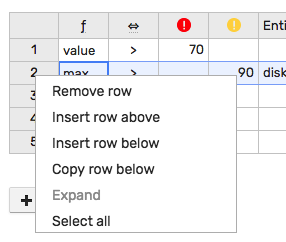
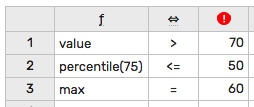
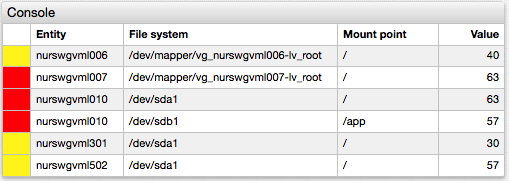

# Overrides

## Overview

The override table provides a convenient way to enumerate exceptions to the default rule condition.

It allows you to minimize the number of rule variations created due to minor differences in the thresholds applicable to specific entity groups, entities or tags.

For example, assuming that the default condition is `value > 50`, the below configuration applies a different threshold (`value > 70`) for entities starting with `nurswgvml0`.


## Override Table

Override tables can be created on the 'Overrides' tab in the rule editor.

The table must have at least one rule where each row represents a single rule consisting of filter and threshold columns.

The rules are processed from **top to bottom**. If the rule filter matches the given window, the processing stops (subsequent rows are ignored) and the rule thresholds are checked. An alert is triggered if the threshold condition for either `ERROR` or `WARNING` level is satisfied.

In case no matching rules are found for the given window, the default condition, as specified on the 'Overview' tab, is evaluated.

> Note that the 'Depends On' condition, when enabled on the 'Overview' tab, is checked for both the override rule and the default condition.


Rows can be inserted, removed, and copied by right-clicking on the row index column.



### Filters

The filter matches the window if it satisfies **all** filter columns including:

* Entity group column
* Entity column
* Tag columns (optional)


> In the example above, the rule matches entities with a name beginning with `nurswg` that are members of the 'disk_prod' group and applies only to windows with  tag `file_system` equal `/tmp`.

The tag columns are present when the rule is grouped by tags on the 'Overview' tab.


Empty columns are ignored. For example, if the entity group is _not_ defined for the current row, the filter checks only the entity and tag columns.

The entity and the tag columns support `*` as the wildcard character.

#### Filter Examples

| Entity Group | Entity | Tag1 | Description |
|---|---|---|---|
| | `*` | | The rule matches **all** windows.|
| `prod` | `*` | | The rule matches entities that are members of the `prod` entity group.|
| `prod` | `nur*`| | The rule matches entities with name starting with `nur` and which are members of the `prod` entity group.|
|  | `*` | abc | The rule matches windows with `Tag1` equal `abc`.|
| `prod` | `*` | `*cde*` | The rule matches windows for members of the `prod` entity group **and** with `Tag1` containing `cde`.|

### Thresholds

The threshold condition is a boolean expression built from the numeric function, the comparison operator, and the threshold value.



```javascript
/*
  Function Operator Threshold
*/
value > 70
percentile(75) <= 50
max() = 60
```

An alert is triggered if either the `ERROR` or `WARNING` condition returns `true`.

### Alert Severity

When one of the threshold conditions is satisfied, the alert is assigned a severity level based on which threshold was met: `ERROR` or `WARNING`.


If both `ERROR` and `WARNING` conditions are `true`, the `ERROR` level takes precedence.



If no override rule matches the window and the alert is eventually triggered by the default condition, the alert is assigned the severity level specified on the 'Logging' tab.


## Override Example

The metric in this example measures disk space usage and is collected with 'file_system' and 'mount_point' tags. The numeric values range between 0% and 100%. The alert must be raised if disk utilization exceeds **80%** unless a custom threshold is found in the Overrides table.

Default Condition

```java
value > 80
```

Override Table


Rule Processing:

* Rules are processed from top to bottom. There are 4 rules in the table.
* Row 1: Since the value cannot be greater than **100%**, this rule effectively disables alerts for `tmp` file systems.
* Row 2. This rule raises `ERROR` alert if disk usage exceeds **50%** for entity `nurswgvml010`.
* Row 3. This rule raises `ERROR` alert if disk usage on `/` mount point exceeds **90%** for entity `nurswgvml007`. Note that once a rule is matched, the default condition is not evaluated for this window, and therefore an alert is be raised for `/` on `nurswgvml007` with disk usage of **85%**.
* Row 4. Raise `ERROR` alert if disk usage exceeds **60%** for any entity in the 'disk_prod' group. Otherwise, raise `WARNING` alert, if disk usage is greater than **30%** for the same entities.
* If not rule was matched, evaluate the default condition.

## Multiple Override Tables

Multiple override tables can be created to trigger different email or webhooks.

## Notifications

If a window changes its status based on Override rules, the event can trigger a specific email or webhook identified by name. Otherwise, it triggers all notifications except those classified as `Use in Overrides Only`.


