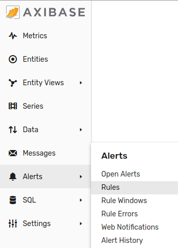
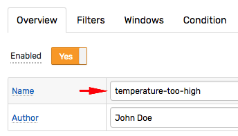
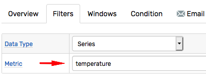
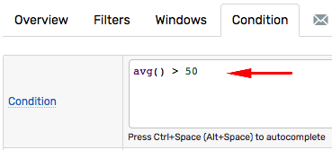
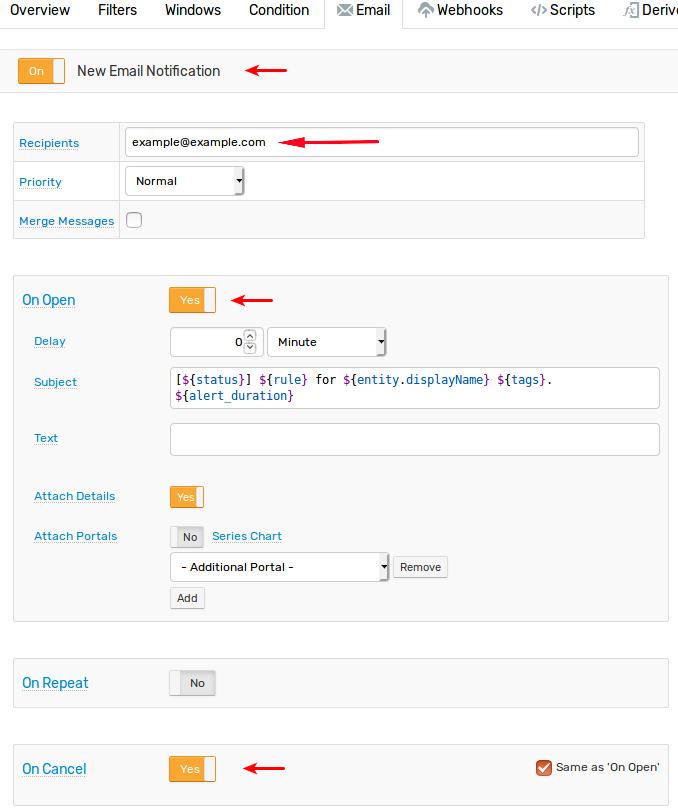
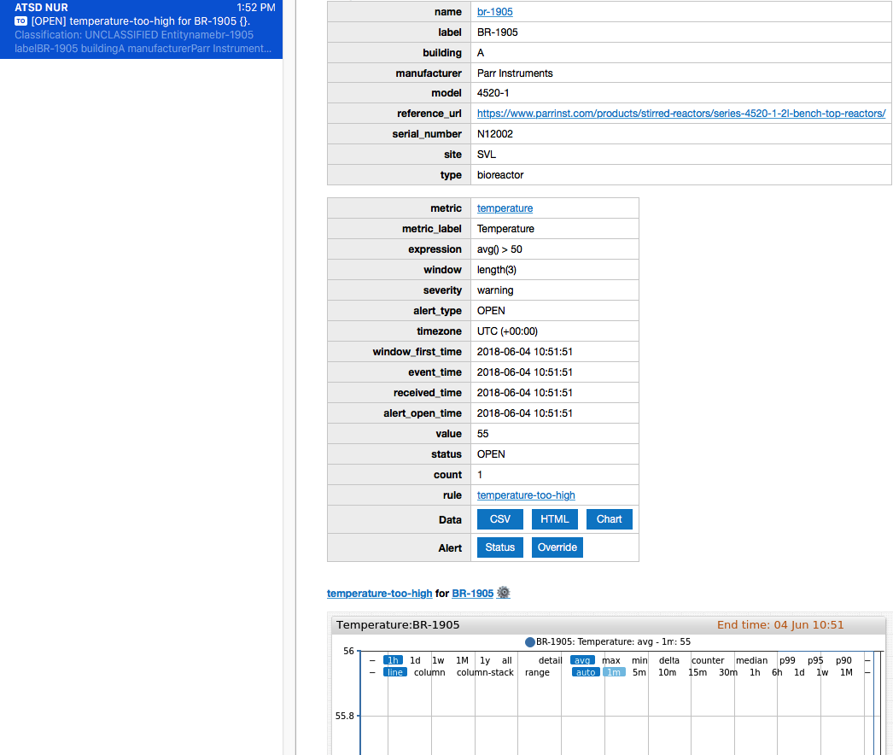
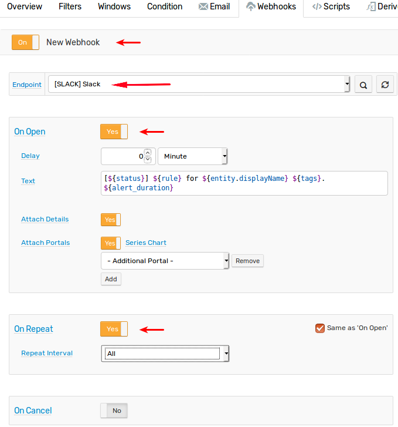
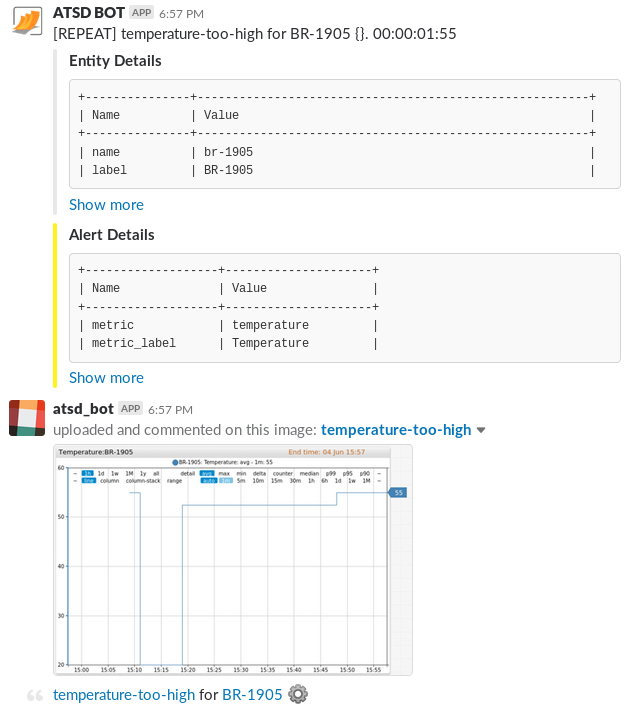

# Getting Started: Alerting

## Contents

1. [Introduction](./getting-started.md)
1. [Inserting Data](./getting-started-insert.md)
1. [Portals](./getting-started-portal.md)
1. [Exporting Data](./getting-started-export.md)
1. [SQL](./getting-started-sql.md)
1. Alerting

## Creating Rules

Open the **Alerts > Rules** page and click **Create** to configure an alert rule for the `temperature` metric using the [Rule Engine](../rule-engine/README.md).




Specify any name for the new rule on the **Overview** tab.



Open the **Filter** tab and enter `temperature` in the **Metric** field.



Open the **Windows** tab and configure the data arrays to contain the most recent `3` samples.


Open the **Condition** tab and enter the following expression in the **Condition** field.

```java
avg() > 50
```

The above [condition](../rule-engine/condition.md) evaluates to `true` and creates an alert if the average value exceeds `50`.



Click **Save** to save and activate the rule.

Return to **Data Entry** and submit a few commands with values greater than `50`.

```ls
series e:br-1905 m:temperature=55
```

Open the **Alerts > Open Alerts** page in the main menu to view currently opened alerts.


Now, insert some commands with lower values to ensure that the average of the last three commands is less than `50`.

```ls
series e:br-1905 m:temperature=20
```

Refresh the **Open Alerts** page to verify that the alert for `temperature-too-high` is closed.

## Email Alerts

To receive alert notifications via email, configure the [Mail Client](../administration/mail-client.md) on **Settings > Mail Client**.

Open the rule editor and enable [alerts](../rule-engine/email.md) on the **Email Notifications** tab as illustrated below.

:::tip Note
To enable sending portal screenshots, configure the [Web Driver](../rule-engine/notifications/web-driver.md).
:::



Save the rule and insert a few samples on the **Data Entry** page again. ATSD sends the following message when the threshold is exceeded:



## Slack Alerts

To receive alerts in [Slack](../rule-engine/notifications/slack.md) create a [bot](../rule-engine/notifications/slack.md#create-bot) user and configure the [`SLACK`](../rule-engine/notifications/slack.md#configure-webhook-in-atsd) webhook.

Open the rule editor and enable alerts on the **Webhooks** tab as illustrated below.



Save the rule and insert commands on the **Data Entry** page again.

The following message appears in Slack when the average exceeds `50` for the last three samples.



Refer to [Outgoing Webhooks](../rule-engine/notifications/README.md) for more details.

## Summary

Congratulations!

You have successfully completed the **Getting Started** Guide for ATSD.

Review [Use Cases](https://axibase.com/use-cases/) for [Research Articles](https://axibase.com/use-cases/research/), [Integration Guides](https://axibase.com/use-cases/integrations/), and advanced [Tutorials](https://axibase.com/use-cases/tutorials/) to make the most of your new database.
